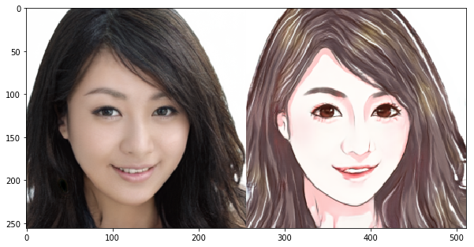
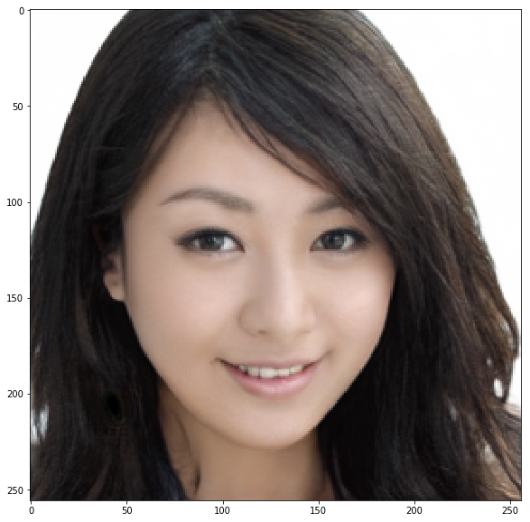
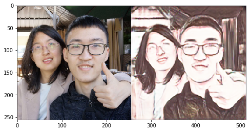

# Day 3 作业--Pixel2Pixel：人像卡通化

经过今天的学习，相信大家对图像翻译、风格迁移有了一定的了解啦，是不是也想自己动手来实现下呢？

那么，为了满足大家动手实践的愿望，同时为了巩固大家学到的知识，我们Day 3的作业便是带大家完成一遍课程讲解过的应用--**Pixel2Pixel：人像卡通化**

在本次作业中，大家需要做的是：**补齐代码，跑通训练，提交一张卡通化的成品图，动手完成自己的第一个人像卡通化的应用~**


## 准备工作：引入依赖 & 数据准备


```python
import paddle
import paddle.nn as nn
from paddle.io import Dataset, DataLoader

import os
import cv2
import numpy as np
from tqdm import tqdm
import matplotlib.pyplot as plt

%matplotlib inline
```

    /opt/conda/envs/python35-paddle120-env/lib/python3.7/site-packages/matplotlib/__init__.py:107: DeprecationWarning: Using or importing the ABCs from 'collections' instead of from 'collections.abc' is deprecated, and in 3.8 it will stop working
      from collections import MutableMapping
    /opt/conda/envs/python35-paddle120-env/lib/python3.7/site-packages/matplotlib/rcsetup.py:20: DeprecationWarning: Using or importing the ABCs from 'collections' instead of from 'collections.abc' is deprecated, and in 3.8 it will stop working
      from collections import Iterable, Mapping
    /opt/conda/envs/python35-paddle120-env/lib/python3.7/site-packages/matplotlib/colors.py:53: DeprecationWarning: Using or importing the ABCs from 'collections' instead of from 'collections.abc' is deprecated, and in 3.8 it will stop working
      from collections import Sized
    2021-04-19 16:24:23,814 - INFO - font search path ['/opt/conda/envs/python35-paddle120-env/lib/python3.7/site-packages/matplotlib/mpl-data/fonts/ttf', '/opt/conda/envs/python35-paddle120-env/lib/python3.7/site-packages/matplotlib/mpl-data/fonts/afm', '/opt/conda/envs/python35-paddle120-env/lib/python3.7/site-packages/matplotlib/mpl-data/fonts/pdfcorefonts']
    2021-04-19 16:24:24,245 - INFO - generated new fontManager


### 数据准备：

- 真人数据来自[seeprettyface](http://www.seeprettyface.com/mydataset.html)。
- 数据预处理（详情见[photo2cartoon](https://github.com/minivision-ai/photo2cartoon)项目）。
<div>
  
</div>

- 使用[photo2cartoon](https://github.com/minivision-ai/photo2cartoon)项目生成真人数据对应的卡通数据。


```python
# 解压数据
!unzip -q data/data79149/cartoon_A2B.zip -d data/
```

### 数据可视化


```python
# 训练数据统计
train_names = os.listdir('data/cartoon_A2B/train')
print(f'训练集数据量: {len(train_names)}')

# 测试数据统计
test_names = os.listdir('data/cartoon_A2B/test')
print(f'测试集数据量: {len(test_names)}')

# 训练数据可视化
imgs = []
for img_name in np.random.choice(train_names, 1, replace=False):
    imgs.append(cv2.imread('data/cartoon_A2B/train/'+img_name))

img_show = np.vstack(imgs)[:,:,::-1]
plt.figure(figsize=(10, 10))
plt.imshow(img_show)
plt.show()

```

    训练集数据量: 1361
    测试集数据量: 100


    /opt/conda/envs/python35-paddle120-env/lib/python3.7/site-packages/matplotlib/cbook/__init__.py:2349: DeprecationWarning: Using or importing the ABCs from 'collections' instead of from 'collections.abc' is deprecated, and in 3.8 it will stop working
      if isinstance(obj, collections.Iterator):
    /opt/conda/envs/python35-paddle120-env/lib/python3.7/site-packages/matplotlib/cbook/__init__.py:2366: DeprecationWarning: Using or importing the ABCs from 'collections' instead of from 'collections.abc' is deprecated, and in 3.8 it will stop working
      return list(data) if isinstance(data, collections.MappingView) else data





```python

img_show = np.vstack(imgs)[:,:256,::-1]
plt.figure(figsize=(10, 10))
plt.imshow(img_show)
plt.show()

img=img_show.transpose((2,0,1))
print(img.shape)
print(img_show.shape)
# img_show = np.vstack(imgs)[:,:256,::-1]
# plt.figure(figsize=(10, 10))
# plt.imshow(img)
# plt.show()
```





    (3, 256, 256)
    (256, 256, 3)


```python
img_show = np.vstack(imgs)[:,:256,::-1]

img_show.shape
```


    (256, 256, 3)


```python
s=np.random.randint(0,255,[3,2])
print(s)
((s+1)/256)*2-1


```

    [[127 201]
     [212   8]
     [150  76]]


    array([[ 0.       ,  0.578125 ],
           [ 0.6640625, -0.9296875],
           [ 0.1796875, -0.3984375]])


```python

```


```python
class PairedData(Dataset):
    def __init__(self, phase):
        super(PairedData, self).__init__() 
        self.img_path_list = self.load_A2B_data(phase)    # 获取数据列表
        self.num_samples = len(self.img_path_list)        # 数据量
        print(self.img_path_list[:7])

    def __getitem__(self, idx):
        path=self.img_path_list[idx]
        img_A2B = cv2.imread(path)                                        # 读取一组数据
        img_A2B = ((img_A2B+1)/256)*2-1                                        # 从0~255归一化至-1~1
        img_A2B = img_A2B.transpose((2,0,1))                                    # 维度变换HWC -> CHW
        img_A = img_A2B[:,:,:256]                                          # 真人照
        img_B = img_A2B[:,:,256:]                                          # 卡通图
        return img_A, img_B

    def __len__(self):
        return self.num_samples

    @staticmethod
    def load_A2B_data(phase):
        assert phase in ['train', 'test'], "phase should be set within ['train', 'test']"
        # 读取数据集，数据中每张图像包含照片和对应的卡通画。
        data_path = 'data/cartoon_A2B/'+phase
        return [os.path.join(data_path, x) for x in os.listdir(data_path)]
```


```python
paired_dataset_train = PairedData('train')
paired_dataset_test = PairedData('test')
```

    ['data/cartoon_A2B/train/01271.png', 'data/cartoon_A2B/train/00712.png', 'data/cartoon_A2B/train/00403.png', 'data/cartoon_A2B/train/00485.png', 'data/cartoon_A2B/train/01319.png', 'data/cartoon_A2B/train/00688.png', 'data/cartoon_A2B/train/01146.png']
    ['data/cartoon_A2B/test/01474.png', 'data/cartoon_A2B/test/01475.png', 'data/cartoon_A2B/test/01486.png', 'data/cartoon_A2B/test/01449.png', 'data/cartoon_A2B/test/01492.png', 'data/cartoon_A2B/test/01512.png', 'data/cartoon_A2B/test/01462.png']


## 第一步：搭建生成器

### 请大家补齐空白处的代码，‘#’ 后是提示。


```python
class UnetGenerator(nn.Layer):
    def __init__(self, input_nc=3, output_nc=3, ngf=64):
        super(UnetGenerator, self).__init__()

        self.down1 = nn.Conv2D(input_nc, ngf, kernel_size=4, stride=2, padding=1)
        self.down2 = Downsample(ngf, ngf*2)
        self.down3 = Downsample(ngf*2, ngf*4)
        self.down4 = Downsample(ngf*4, ngf*8)
        self.down5 = Downsample(ngf*8, ngf*8)
        self.down6 = Downsample(ngf*8, ngf*8)
        self.down7 = Downsample(ngf*8, ngf*8)

        self.center = Downsample(ngf*8, ngf*8)

        self.up7 = Upsample(ngf*8, ngf*8, use_dropout=True)
        self.up6 = Upsample(ngf*8*2, ngf*8, use_dropout=True)
        self.up5 = Upsample(ngf*8*2, ngf*8, use_dropout=True)
        self.up4 = Upsample(ngf*8*2, ngf*8)
        self.up3 = Upsample(ngf*8*2, ngf*4)
        self.up2 = Upsample(ngf*4*2, ngf*2)
        self.up1 = Upsample(ngf*2*2, ngf)

        self.output_block = nn.Sequential(
            nn.ReLU(),
            nn.Conv2DTranspose(ngf*2, output_nc, kernel_size=4, stride=2, padding=1),
            nn.Tanh()
        )

    def forward(self, x):
        d1 = self.down1(x)
        d2 = self.down2(d1)
        d3 = self.down3(d2)
        d4 = self.down4(d3)
        d5 = self.down5(d4)
        d6 = self.down6(d5)
        d7 = self.down7(d6)
        
        c = self.center(d7)
        
        x = self.up7(c, d7)
        x = self.up6(x, d6)
        x = self.up5(x, d5)
        x = self.up4(x, d4)
        x = self.up3(x, d3)
        x = self.up2(x, d2)
        x = self.up1(x, d1)

        x = self.output_block(x)
        return x


class Downsample(nn.Layer):
    # LeakyReLU => conv => batch norm
    def __init__(self, in_dim, out_dim, kernel_size=4, stride=2, padding=1):
        super(Downsample, self).__init__()

        self.layers = nn.Sequential(

            nn.LeakyReLU(0.2),
            nn.Conv2D(in_dim, out_dim, kernel_size),
            nn.BatchNorm2D(out_dim)
                                # LeakyReLU, leaky=0.2
                                # Conv2D
                                # BatchNorm2D
        )

    def forward(self, x):
        x = self.layers(x)
        return x


class Upsample(nn.Layer):
    # ReLU => deconv => batch norm => dropout
    def __init__(self, in_dim, out_dim, kernel_size=4, stride=2, padding=1, use_dropout=False):
        super(Upsample, self).__init__()

        sequence = [
            nn.ReLU(),                    # ReLU
            nn.Conv2DTranspose(in_dim, out_dim, kernel_size),                    # Conv2DTranspose
            nn.BatchNorm2D(out_dim)                    # nn.BatchNorm2D
        ]

        if use_dropout:
            sequence.append(nn.Dropout(p=0.5))

        self.layers = nn.Sequential(*sequence)

    def forward(self, x, skip):
        x = self.layers(x)
        x = paddle.concat([x, skip], axis=1)
        return x
```

## 第二步：鉴别器的搭建

### 请大家补齐空白处的代码，‘#’ 后是提示。


```python
class NLayerDiscriminator(nn.Layer):
    def __init__(self, input_nc=6, ndf=64):
        super(NLayerDiscriminator, self).__init__()

        self.layers = nn.Sequential(
            nn.Conv2D(input_nc, ndf, kernel_size=4, stride=2, padding=1), 
            nn.LeakyReLU(0.2),
            
            ConvBlock(ndf, ndf*2),
            ConvBlock(ndf*2, ndf*4),
            ConvBlock(ndf*4, ndf*8, stride=1),

            nn.Conv2D(ndf*8, 1, kernel_size=4, stride=1, padding=1),
            nn.Sigmoid()
        )

    def forward(self, input):
        return self.layers(input)


class ConvBlock(nn.Layer):
    # conv => batch norm => LeakyReLU
    def __init__(self, in_dim, out_dim, kernel_size=4, stride=2, padding=1):
        super(ConvBlock, self).__init__()

        self.layers = nn.Sequential(
            nn.Conv2D(in_dim, out_dim, kernel_size),
            nn.BatchNorm2D(out_dim),
            nn.LeakyReLU(0.2)
                                # Conv2D
                                # BatchNorm2D
                                # LeakyReLU, leaky=0.2
        )

    def forward(self, x):
        x = self.layers(x)
        return x
```


```python
generator = UnetGenerator()
discriminator = NLayerDiscriminator()
```


```python
print(discriminator)
```

    NLayerDiscriminator(
      (layers): Sequential(
        (0): Conv2D(6, 64, kernel_size=[4, 4], stride=[2, 2], padding=1, data_format=NCHW)
        (1): LeakyReLU(negative_slope=0.2)
        (2): ConvBlock(
          (layers): Sequential(
            (0): Conv2D(64, 128, kernel_size=[4, 4], data_format=NCHW)
            (1): BatchNorm2D(num_features=128, momentum=0.9, epsilon=1e-05)
            (2): LeakyReLU(negative_slope=0.2)
          )
        )
        (3): ConvBlock(
          (layers): Sequential(
            (0): Conv2D(128, 256, kernel_size=[4, 4], data_format=NCHW)
            (1): BatchNorm2D(num_features=256, momentum=0.9, epsilon=1e-05)
            (2): LeakyReLU(negative_slope=0.2)
          )
        )
        (4): ConvBlock(
          (layers): Sequential(
            (0): Conv2D(256, 512, kernel_size=[4, 4], data_format=NCHW)
            (1): BatchNorm2D(num_features=512, momentum=0.9, epsilon=1e-05)
            (2): LeakyReLU(negative_slope=0.2)
          )
        )
        (5): Conv2D(512, 1, kernel_size=[4, 4], padding=1, data_format=NCHW)
        (6): Sigmoid()
      )
    )


```python
out = generator(paddle.ones([1, 3, 256, 256]))
print('生成器输出尺寸：', out.shape)  # 应为[1, 3, 256, 256]

out = discriminator(paddle.ones([1, 6, 256, 256]))
print('鉴别器输出尺寸：', out.shape)  # 应为[1, 1, 30, 30]
```

    生成器输出尺寸： [1, 3, 256, 256]
    鉴别器输出尺寸： [1, 1, 118, 118]


    /opt/conda/envs/python35-paddle120-env/lib/python3.7/site-packages/paddle/nn/layer/norm.py:648: UserWarning: When training, we now always track global mean and variance.
      "When training, we now always track global mean and variance.")


```python
# 超参数
LR = 1e-4
BATCH_SIZE = 8
EPOCHS = 100

# 优化器
optimizerG = paddle.optimizer.Adam(
    learning_rate=LR,
    parameters=generator.parameters(),
    beta1=0.5,
    beta2=0.999)

optimizerD = paddle.optimizer.Adam(
    learning_rate=LR,
    parameters=discriminator.parameters(), 
    beta1=0.5,
    beta2=0.999)
    
# 损失函数
bce_loss = paddle.nn.BCELoss()
l1_loss = paddle.nn.L1Loss()

# dataloader
data_loader_train = DataLoader(
    paired_dataset_train,
    batch_size=BATCH_SIZE,
    shuffle=True,
    drop_last=True
    )

data_loader_test = DataLoader(
    paired_dataset_test,
    batch_size=BATCH_SIZE
    )
```


```python
results_save_path = 'work/results'
os.makedirs(results_save_path, exist_ok=True)  # 保存每个epoch的测试结果

weights_save_path = 'work/weights'
os.makedirs(weights_save_path, exist_ok=True)  # 保存模型

for epoch in range(EPOCHS):
    for data in tqdm(data_loader_train):
        data_A, data_B = data
        real_A=data_A.astype(np.float32)
        real_B=data_B.astype(np.float32)
        # real_A, real_B = data
        # print(real_A.shape)
        # print(real_A.type)
        # print(real_B.shape)
        optimizerD.clear_grad()
        # D([real_A, real_B])
        real_AB = paddle.concat((real_A, real_B), 1)
        d_real_predict = discriminator(real_AB)
        d_real_loss = bce_loss(d_real_predict, paddle.ones_like(d_real_predict))

        # D([real_A, fake_B])
        fake_B = generator(real_A)
        fake_AB =  paddle.concat((real_A, fake_B), 1)
        d_fake_predict = discriminator(fake_AB)
        d_fake_loss = bce_loss(d_fake_predict, paddle.zeros_like(d_fake_predict))
        
        # train D
        d_loss = (d_real_loss + d_fake_loss) / 2.
        d_loss.backward()
        optimizerD.step()

        optimizerG.clear_grad()
        # D([real_A, fake_B])
        fake_B = generator(real_A) 
        fake_AB = paddle.concat((real_A, fake_B), 1) 
        g_fake_predict =  discriminator(fake_AB)
        g_bce_loss = bce_loss(g_fake_predict, paddle.ones_like(g_fake_predict))
        g_l1_loss = l1_loss(fake_AB,real_AB)
        g_loss = g_bce_loss + g_l1_loss * 100.
        
        # train G
        g_loss.backward()
        optimizerG.step()

    print(f'Epoch [{epoch+1}/{EPOCHS}] Loss D: {d_loss.numpy()}, Loss G: {g_loss.numpy()}')

    if (epoch+1) % 10 == 0:
        paddle.save(generator.state_dict(), os.path.join(weights_save_path, 'epoch'+str(epoch+1).zfill(3)+'.pdparams'))

        # test
        generator.eval()
        with paddle.no_grad():
            for data in data_loader_test:
                real_A, real_B = data
                break

            fake_B = generator(real_A)
            result = paddle.concat([real_A[:3], real_B[:3], fake_B[:3]], 3)

            result = result.detach().numpy().transpose(0, 2, 3, 1)
            result = np.vstack(result)
            result = (result * 127.5 + 127.5).astype(np.uint8)
    
        cv2.imwrite(os.path.join(results_save_path, 'epoch'+str(epoch+1).zfill(3)+'.png'), result)

        generator.train()
```

    
      0%|          | 0/170 [00:00<?, ?it/s]
      1%|          | 1/170 [00:04<11:22,  4.04s/it]
      1%|          | 2/170 [00:09<12:41,  4.53s/it]
      2%|▏         | 3/170 [00:15<13:35,  4.88s/it]
      2%|▏         | 4/170 [00:21<14:12,  5.13s/it]
      3%|▎         | 5/170 [00:26<14:36,  5.31s/it]
      4%|▎         | 6/170 [00:32<14:51,  5.44s/it]
      4%|▍         | 7/170 [00:38<15:00,  5.52s/it]
      5%|▍         | 8/170 [00:44<15:04,  5.59s/it]
      5%|▌         | 9/170 [00:49<15:06,  5.63s/it]
      6%|▌         | 10/170 [00:55<15:06,  5.66s/it]
      6%|▋         | 11/170 [01:01<15:04,  5.69s/it]
      7%|▋         | 12/170 [01:07<15:01,  5.71s/it]
      8%|▊         | 13/170 [01:12<14:57,  5.72s/it]
      8%|▊         | 14/170 [01:18<14:53,  5.73s/it]
      9%|▉         | 15/170 [01:24<14:49,  5.74s/it]
      9%|▉         | 16/170 [01:30<14:43,  5.74s/it]
     10%|█         | 17/170 [01:35<14:38,  5.74s/it]
     11%|█         | 18/170 [01:41<14:34,  5.75s/it]
     11%|█         | 19/170 [01:47<14:28,  5.75s/it]
     12%|█▏        | 20/170 [01:53<14:23,  5.76s/it]
     12%|█▏        | 21/170 [01:58<14:17,  5.76s/it]
     13%|█▎        | 22/170 [02:04<14:12,  5.76s/it]
     14%|█▎        | 23/170 [02:10<14:06,  5.76s/it]
     14%|█▍        | 24/170 [02:16<14:01,  5.76s/it]
     15%|█▍        | 25/170 [02:21<13:55,  5.76s/it]
     15%|█▌        | 26/170 [02:27<13:50,  5.77s/it]
     16%|█▌        | 27/170 [02:33<13:44,  5.77s/it]
     16%|█▋        | 28/170 [02:39<13:39,  5.77s/it]
     17%|█▋        | 29/170 [02:44<13:33,  5.77s/it]
     18%|█▊        | 30/170 [02:50<13:27,  5.77s/it]
     18%|█▊        | 31/170 [02:56<13:22,  5.77s/it]
     19%|█▉        | 32/170 [03:02<13:16,  5.77s/it]
     19%|█▉        | 33/170 [03:08<13:10,  5.77s/it]
     20%|██        | 34/170 [03:13<13:05,  5.77s/it]
     21%|██        | 35/170 [03:19<12:58,  5.77s/it]
     21%|██        | 36/170 [03:25<12:53,  5.77s/it]
     22%|██▏       | 37/170 [03:31<12:47,  5.77s/it]
     22%|██▏       | 38/170 [03:36<12:41,  5.77s/it]
     23%|██▎       | 39/170 [03:42<12:36,  5.77s/it]
     24%|██▎       | 40/170 [03:48<12:30,  5.78s/it]
     24%|██▍       | 41/170 [03:54<12:25,  5.78s/it]
     25%|██▍       | 42/170 [04:00<12:19,  5.78s/it]
     25%|██▌       | 43/170 [04:05<12:13,  5.78s/it]
     26%|██▌       | 44/170 [04:11<12:07,  5.77s/it]
     26%|██▋       | 45/170 [04:17<12:02,  5.78s/it]
     27%|██▋       | 46/170 [04:23<11:56,  5.77s/it]
     28%|██▊       | 47/170 [04:28<11:50,  5.77s/it]
     28%|██▊       | 48/170 [04:34<11:44,  5.77s/it]
     29%|██▉       | 49/170 [04:40<11:38,  5.77s/it]
     29%|██▉       | 50/170 [04:46<11:32,  5.77s/it]
     30%|███       | 51/170 [04:51<11:27,  5.77s/it]
     31%|███       | 52/170 [04:57<11:21,  5.78s/it]
     34%|███▍      | 58/170 [05:32<10:46,  5.77s/it]
     35%|███▍      | 59/170 [05:38<10:41,  5.78s/it]
     35%|███▌      | 60/170 [05:43<10:35,  5.77s/it]
     36%|███▌      | 61/170 [05:49<10:29,  5.78s/it]
     36%|███▋      | 62/170 [05:55<10:23,  5.77s/it]
     37%|███▋      | 63/170 [06:01<10:17,  5.77s/it]
     38%|███▊      | 64/170 [06:07<10:11,  5.77s/it]
     38%|███▊      | 65/170 [06:12<10:06,  5.77s/it]
     39%|███▉      | 66/170 [06:18<10:00,  5.77s/it]
     39%|███▉      | 67/170 [06:24<09:54,  5.77s/it]
     40%|████      | 68/170 [06:30<09:49,  5.77s/it]
     41%|████      | 69/170 [06:35<09:43,  5.78s/it]
     41%|████      | 70/170 [06:41<09:37,  5.78s/it]
     42%|████▏     | 71/170 [06:47<09:31,  5.78s/it]
     42%|████▏     | 72/170 [06:53<09:26,  5.78s/it]
     43%|████▎     | 73/170 [06:59<09:20,  5.78s/it]
     44%|████▎     | 74/170 [07:04<09:14,  5.78s/it]
     44%|████▍     | 75/170 [07:10<09:08,  5.78s/it]
     45%|████▍     | 76/170 [07:16<09:02,  5.78s/it]
     45%|████▌     | 77/170 [07:22<08:57,  5.78s/it]
     46%|████▌     | 78/170 [07:27<08:51,  5.77s/it]
     46%|████▋     | 79/170 [07:33<08:45,  5.78s/it]
     47%|████▋     | 80/170 [07:39<08:39,  5.78s/it]
     48%|████▊     | 81/170 [07:45<08:34,  5.78s/it]
     48%|████▊     | 82/170 [07:51<08:28,  5.78s/it]
     49%|████▉     | 83/170 [07:56<08:22,  5.78s/it]
     49%|████▉     | 84/170 [08:02<08:16,  5.78s/it]
     50%|█████     | 85/170 [08:08<08:11,  5.78s/it]
     51%|█████     | 86/170 [08:14<08:05,  5.78s/it]
     51%|█████     | 87/170 [08:19<07:59,  5.77s/it]
     52%|█████▏    | 88/170 [08:25<07:53,  5.78s/it]
     52%|█████▏    | 89/170 [08:31<07:47,  5.77s/it]
     53%|█████▎    | 90/170 [08:37<07:41,  5.77s/it]
     54%|█████▎    | 91/170 [08:43<07:36,  5.78s/it]
     54%|█████▍    | 92/170 [08:48<07:30,  5.77s/it]
     55%|█████▍    | 93/170 [08:54<07:24,  5.77s/it]
     55%|█████▌    | 94/170 [09:00<07:18,  5.77s/it]
     56%|█████▌    | 95/170 [09:06<07:13,  5.78s/it]
     56%|█████▋    | 96/170 [09:11<07:07,  5.78s/it]
     57%|█████▋    | 97/170 [09:17<07:01,  5.78s/it]
     58%|█████▊    | 98/170 [09:23<06:55,  5.78s/it]
     58%|█████▊    | 99/170 [09:29<06:50,  5.78s/it]
     59%|█████▉    | 100/170 [09:35<06:44,  5.78s/it]
     59%|█████▉    | 101/170 [09:40<06:38,  5.78s/it]
     60%|██████    | 102/170 [09:46<06:32,  5.78s/it]
     61%|██████    | 103/170 [09:52<06:26,  5.78s/it]
     61%|██████    | 104/170 [09:58<06:21,  5.78s/it]
     62%|██████▏   | 105/170 [10:03<06:15,  5.78s/it]
     62%|██████▏   | 106/170 [10:09<06:09,  5.78s/it]
     63%|██████▎   | 107/170 [10:15<06:04,  5.78s/it]
     64%|██████▎   | 108/170 [10:21<05:58,  5.78s/it]
     64%|██████▍   | 109/170 [10:27<05:52,  5.78s/it]
     65%|██████▍   | 110/170 [10:32<05:46,  5.78s/it]
     65%|██████▌   | 111/170 [10:38<05:40,  5.78s/it]
     66%|██████▌   | 112/170 [10:44<05:35,  5.78s/it]
     66%|██████▋   | 113/170 [10:50<05:29,  5.78s/it]
     67%|██████▋   | 114/170 [10:55<05:23,  5.78s/it]
     68%|██████▊   | 115/170 [11:01<05:17,  5.78s/it]
     68%|██████▊   | 116/170 [11:07<05:11,  5.78s/it]
     69%|██████▉   | 117/170 [11:13<05:05,  5.77s/it]
     69%|██████▉   | 118/170 [11:18<05:00,  5.78s/it]
     70%|███████   | 119/170 [11:24<04:54,  5.77s/it]
     71%|███████   | 120/170 [11:30<04:48,  5.78s/it]
     71%|███████   | 121/170 [11:36<04:42,  5.77s/it]
     72%|███████▏  | 122/170 [11:42<04:37,  5.78s/it]
     72%|███████▏  | 123/170 [11:47<04:31,  5.77s/it]
     73%|███████▎  | 124/170 [11:53<04:25,  5.78s/it]
     74%|███████▎  | 125/170 [11:59<04:19,  5.78s/it]
     74%|███████▍  | 126/170 [12:05<04:14,  5.78s/it]
     75%|███████▍  | 127/170 [12:10<04:08,  5.78s/it]
     75%|███████▌  | 128/170 [12:16<04:02,  5.78s/it]
     76%|███████▌  | 129/170 [12:22<03:56,  5.78s/it]
     76%|███████▋  | 130/170 [12:28<03:51,  5.78s/it]
     77%|███████▋  | 131/170 [12:34<03:45,  5.78s/it]
     78%|███████▊  | 132/170 [12:39<03:39,  5.78s/it]
     78%|███████▊  | 133/170 [12:45<03:33,  5.77s/it]
     79%|███████▉  | 134/170 [12:51<03:27,  5.78s/it]
     79%|███████▉  | 135/170 [12:57<03:22,  5.78s/it]
     80%|████████  | 136/170 [13:02<03:16,  5.78s/it]
     81%|████████  | 137/170 [13:08<03:10,  5.78s/it]
     81%|████████  | 138/170 [13:14<03:04,  5.78s/it]
     82%|████████▏ | 139/170 [13:20<02:59,  5.78s/it]
     82%|████████▏ | 140/170 [13:26<02:53,  5.78s/it]
     83%|████████▎ | 141/170 [13:31<02:47,  5.78s/it]
     84%|████████▎ | 142/170 [13:37<02:41,  5.78s/it]
     84%|████████▍ | 143/170 [13:43<02:35,  5.78s/it]
     85%|████████▍ | 144/170 [13:49<02:30,  5.78s/it]
     85%|████████▌ | 145/170 [13:54<02:24,  5.78s/it]
     86%|████████▌ | 146/170 [14:00<02:18,  5.77s/it]
     86%|████████▋ | 147/170 [14:06<02:12,  5.78s/it]
     87%|████████▋ | 148/170 [14:12<02:07,  5.77s/it]
     88%|████████▊ | 149/170 [14:18<02:01,  5.77s/it]
     88%|████████▊ | 150/170 [14:23<01:55,  5.78s/it]
     89%|████████▉ | 151/170 [14:29<01:49,  5.77s/it]
     89%|████████▉ | 152/170 [14:35<01:43,  5.78s/it]
     90%|█████████ | 153/170 [14:41<01:38,  5.78s/it]
     91%|█████████ | 154/170 [14:46<01:32,  5.78s/it]
     91%|█████████ | 155/170 [14:52<01:26,  5.78s/it]
     92%|█████████▏| 156/170 [14:58<01:20,  5.78s/it]
     92%|█████████▏| 157/170 [15:04<01:15,  5.78s/it]
     93%|█████████▎| 158/170 [15:10<01:09,  5.77s/it]
     94%|█████████▎| 159/170 [15:15<01:03,  5.77s/it]
     94%|█████████▍| 160/170 [15:21<00:57,  5.77s/it]
     95%|█████████▍| 161/170 [15:27<00:51,  5.78s/it]
     95%|█████████▌| 162/170 [15:33<00:46,  5.77s/it]
     96%|█████████▌| 163/170 [15:38<00:40,  5.77s/it]
     96%|█████████▋| 164/170 [15:44<00:34,  5.77s/it]
     97%|█████████▋| 165/170 [15:50<00:28,  5.78s/it]
     98%|█████████▊| 166/170 [15:56<00:23,  5.78s/it]
     98%|█████████▊| 167/170 [16:02<00:17,  5.77s/it]
     99%|█████████▉| 168/170 [16:07<00:11,  5.78s/it]
     99%|█████████▉| 169/170 [16:13<00:05,  5.77s/it]
    100%|██████████| 170/170 [16:19<00:00,  5.76s/it]
    
      0%|          | 0/170 [00:00<?, ?it/s]

    Epoch [1/100] Loss D: [0.5379108], Loss G: [9.202932]


    
      1%|          | 1/170 [00:04<11:23,  4.04s/it]
      1%|          | 2/170 [00:09<12:46,  4.56s/it]
      2%|▏         | 3/170 [00:15<13:41,  4.92s/it]
      2%|▏         | 4/170 [00:21<14:19,  5.18s/it]
      3%|▎         | 5/170 [00:27<14:43,  5.36s/it]
      4%|▎         | 6/170 [00:32<14:59,  5.48s/it]
      4%|▍         | 7/170 [00:38<15:07,  5.57s/it]
      5%|▍         | 8/170 [00:44<15:12,  5.63s/it]
      5%|▌         | 9/170 [00:50<15:13,  5.68s/it]
      6%|▌         | 10/170 [00:56<15:13,  5.71s/it]
      6%|▋         | 11/170 [01:01<15:10,  5.73s/it]
      7%|▋         | 12/170 [01:07<15:06,  5.74s/it]
      8%|▊         | 13/170 [01:13<15:03,  5.75s/it]
      8%|▊         | 14/170 [01:19<14:58,  5.76s/it]
      9%|▉         | 15/170 [01:24<14:53,  5.76s/it]
      9%|▉         | 16/170 [01:30<14:48,  5.77s/it]
     10%|█         | 17/170 [01:36<14:42,  5.77s/it]
     11%|█         | 18/170 [01:42<14:36,  5.77s/it]
     11%|█         | 19/170 [01:47<14:31,  5.77s/it]
     12%|█▏        | 20/170 [01:53<14:25,  5.77s/it]
     12%|█▏        | 21/170 [01:59<14:20,  5.77s/it]
     13%|█▎        | 22/170 [02:05<14:14,  5.78s/it]
     14%|█▎        | 23/170 [02:11<14:09,  5.78s/it]
     14%|█▍        | 24/170 [02:16<14:03,  5.78s/it]
     15%|█▍        | 25/170 [02:22<13:57,  5.78s/it]
     15%|█▌        | 26/170 [02:28<13:51,  5.78s/it]
     16%|█▌        | 27/170 [02:34<13:46,  5.78s/it]
     16%|█▋        | 28/170 [02:39<13:40,  5.78s/it]
     17%|█▋        | 29/170 [02:45<13:34,  5.78s/it]
     18%|█▊        | 30/170 [02:51<13:28,  5.77s/it]
     18%|█▊        | 31/170 [02:57<13:22,  5.77s/it]
     19%|█▉        | 32/170 [03:03<13:16,  5.77s/it]
     19%|█▉        | 33/170 [03:08<13:10,  5.77s/it]
     20%|██        | 34/170 [03:14<13:05,  5.77s/it]
     21%|██        | 35/170 [03:20<12:59,  5.77s/it]
     21%|██        | 36/170 [03:26<12:54,  5.78s/it]
     22%|██▏       | 37/170 [03:31<12:48,  5.78s/it]
     22%|██▏       | 38/170 [03:37<12:42,  5.78s/it]
     23%|██▎       | 39/170 [03:43<12:36,  5.77s/it]
     24%|██▎       | 40/170 [03:49<12:30,  5.78s/it]
     24%|██▍       | 41/170 [03:55<12:25,  5.78s/it]
     25%|██▍       | 42/170 [04:00<12:18,  5.77s/it]
     25%|██▌       | 43/170 [04:06<12:13,  5.78s/it]
     26%|██▌       | 44/170 [04:12<12:07,  5.77s/it]
     26%|██▋       | 45/170 [04:18<12:01,  5.78s/it]
     27%|██▋       | 46/170 [04:23<11:55,  5.77s/it]
     28%|██▊       | 47/170 [04:29<11:50,  5.78s/it]
     28%|██▊       | 48/170 [04:35<11:44,  5.78s/it]
     29%|██▉       | 49/170 [04:41<11:39,  5.78s/it]
     29%|██▉       | 50/170 [04:47<11:33,  5.78s/it]
     30%|███       | 51/170 [04:52<11:28,  5.78s/it]
     31%|███       | 52/170 [04:58<11:22,  5.78s/it]
     31%|███       | 53/170 [05:04<11:17,  5.79s/it]
     32%|███▏      | 54/170 [05:10<11:11,  5.79s/it]
     32%|███▏      | 55/170 [05:15<11:05,  5.79s/it]
     33%|███▎      | 56/170 [05:21<10:59,  5.79s/it]
     34%|███▎      | 57/170 [05:27<10:53,  5.79s/it]
     34%|███▍      | 58/170 [05:33<10:47,  5.78s/it]
     35%|███▍      | 59/170 [05:39<10:42,  5.79s/it]
     35%|███▌      | 60/170 [05:44<10:36,  5.79s/it]
     36%|███▌      | 61/170 [05:50<10:30,  5.79s/it]
     36%|███▋      | 62/170 [05:56<10:24,  5.79s/it]
     37%|███▋      | 63/170 [06:02<10:19,  5.79s/it]
     38%|███▊      | 64/170 [06:08<10:13,  5.78s/it]
     38%|███▊      | 65/170 [06:13<10:07,  5.78s/it]
     39%|███▉      | 66/170 [06:19<10:01,  5.78s/it]
     39%|███▉      | 67/170 [06:25<09:55,  5.78s/it]
     40%|████      | 68/170 [06:31<09:49,  5.78s/it]
     41%|████      | 69/170 [06:36<09:44,  5.78s/it]
     41%|████      | 70/170 [06:42<09:38,  5.78s/it]
     42%|████▏     | 71/170 [06:48<09:32,  5.78s/it]
     42%|████▏     | 72/170 [06:54<09:26,  5.78s/it]
     43%|████▎     | 73/170 [07:00<09:20,  5.78s/it]
     44%|████▎     | 74/170 [07:05<09:15,  5.78s/it]
     44%|████▍     | 75/170 [07:11<09:09,  5.78s/it]
     45%|████▍     | 76/170 [07:17<09:03,  5.78s/it]
     45%|████▌     | 77/170 [07:23<08:57,  5.78s/it]
     46%|████▌     | 78/170 [07:29<08:52,  5.78s/it]
     46%|████▋     | 79/170 [07:34<08:46,  5.78s/it]
     47%|████▋     | 80/170 [07:40<08:40,  5.78s/it]
     48%|████▊     | 81/170 [07:46<08:34,  5.78s/it]
     48%|████▊     | 82/170 [07:52<08:28,  5.78s/it]
     49%|████▉     | 83/170 [07:57<08:22,  5.78s/it]
     49%|████▉     | 84/170 [08:03<08:17,  5.78s/it]
     50%|█████     | 85/170 [08:09<08:11,  5.78s/it]
     51%|█████     | 86/170 [08:15<08:05,  5.78s/it]
     51%|█████     | 87/170 [08:21<07:59,  5.78s/it]
     52%|█████▏    | 88/170 [08:26<07:54,  5.78s/it]
     52%|█████▏    | 89/170 [08:32<07:48,  5.78s/it]
     53%|█████▎    | 90/170 [08:38<07:42,  5.78s/it]
     54%|█████▎    | 91/170 [08:44<07:36,  5.78s/it]
     54%|█████▍    | 92/170 [08:49<07:30,  5.78s/it]
     55%|█████▍    | 93/170 [08:55<07:24,  5.78s/it]
     55%|█████▌    | 94/170 [09:01<07:19,  5.78s/it]
     56%|█████▌    | 95/170 [09:07<07:13,  5.78s/it]
     56%|█████▋    | 96/170 [09:13<07:07,  5.78s/it]
     57%|█████▋    | 97/170 [09:18<07:01,  5.78s/it]
     58%|█████▊    | 98/170 [09:24<06:55,  5.78s/it]
     58%|█████▊    | 99/170 [09:30<06:50,  5.78s/it]
     59%|█████▉    | 100/170 [09:36<06:44,  5.78s/it]
     59%|█████▉    | 101/170 [09:41<06:38,  5.78s/it]
     60%|██████    | 102/170 [09:47<06:32,  5.78s/it]
     61%|██████    | 103/170 [09:53<06:27,  5.78s/it]
     61%|██████    | 104/170 [09:59<06:21,  5.78s/it]
     62%|██████▏   | 105/170 [10:05<06:15,  5.78s/it]
     62%|██████▏   | 106/170 [10:10<06:09,  5.78s/it]
     63%|██████▎   | 107/170 [10:16<06:04,  5.78s/it]
     64%|██████▎   | 108/170 [10:22<05:58,  5.78s/it]
     64%|██████▍   | 109/170 [10:28<05:52,  5.78s/it]
     65%|██████▍   | 110/170 [10:33<05:47,  5.78s/it]
     65%|██████▌   | 111/170 [10:39<05:41,  5.78s/it]
     66%|██████▌   | 112/170 [10:45<05:35,  5.78s/it]
     66%|██████▋   | 113/170 [10:51<05:29,  5.78s/it]
     67%|██████▋   | 114/170 [10:57<05:23,  5.78s/it]
     68%|██████▊   | 115/170 [11:02<05:17,  5.78s/it]
     68%|██████▊   | 116/170 [11:08<05:12,  5.78s/it]
     69%|██████▉   | 117/170 [11:14<05:06,  5.78s/it]
     69%|██████▉   | 118/170 [11:20<05:01,  5.79s/it]
     70%|███████   | 119/170 [11:26<04:56,  5.81s/it]
     71%|███████   | 120/170 [11:31<04:49,  5.80s/it]
     71%|███████   | 121/170 [11:37<04:43,  5.79s/it]
     72%|███████▏  | 122/170 [11:43<04:37,  5.79s/it]
     72%|███████▏  | 123/170 [11:49<04:31,  5.79s/it]
     73%|███████▎  | 124/170 [11:55<04:26,  5.78s/it]
     74%|███████▎  | 125/170 [12:00<04:20,  5.79s/it]
     74%|███████▍  | 126/170 [12:06<04:14,  5.78s/it]
     75%|███████▍  | 127/170 [12:12<04:08,  5.78s/it]
     75%|███████▌  | 128/170 [12:18<04:02,  5.78s/it]
     76%|███████▌  | 129/170 [12:23<03:56,  5.78s/it]
     76%|███████▋  | 130/170 [12:29<03:51,  5.78s/it]
     77%|███████▋  | 131/170 [12:35<03:45,  5.78s/it]
     78%|███████▊  | 132/170 [12:41<03:39,  5.78s/it]
     78%|███████▊  | 133/170 [12:47<03:33,  5.78s/it]
     79%|███████▉  | 134/170 [12:52<03:28,  5.78s/it]
     79%|███████▉  | 135/170 [12:58<03:22,  5.78s/it]
     80%|████████  | 136/170 [13:04<03:16,  5.78s/it]
     81%|████████  | 137/170 [13:10<03:10,  5.78s/it]
     81%|████████  | 138/170 [13:15<03:04,  5.78s/it]
     82%|████████▏ | 139/170 [13:21<02:59,  5.78s/it]
     82%|████████▏ | 140/170 [13:27<02:53,  5.78s/it]
     83%|████████▎ | 141/170 [13:33<02:47,  5.78s/it]
     84%|████████▎ | 142/170 [13:39<02:41,  5.78s/it]
     84%|████████▍ | 143/170 [13:44<02:36,  5.78s/it]
     85%|████████▍ | 144/170 [13:50<02:30,  5.78s/it]
     85%|████████▌ | 145/170 [13:56<02:24,  5.78s/it]
     86%|████████▌ | 146/170 [14:02<02:18,  5.78s/it]
     86%|████████▋ | 147/170 [14:07<02:13,  5.78s/it]
     87%|████████▋ | 148/170 [14:13<02:07,  5.78s/it]
     88%|████████▊ | 149/170 [14:19<02:01,  5.78s/it]
     88%|████████▊ | 150/170 [14:25<01:55,  5.78s/it]
     89%|████████▉ | 151/170 [14:31<01:49,  5.78s/it]
     89%|████████▉ | 152/170 [14:36<01:44,  5.78s/it]
     90%|█████████ | 153/170 [14:42<01:38,  5.78s/it]
     91%|█████████ | 154/170 [14:48<01:32,  5.78s/it]
     91%|█████████ | 155/170 [14:54<01:26,  5.80s/it]
     92%|█████████▏| 156/170 [15:00<01:21,  5.81s/it]
     92%|█████████▏| 157/170 [15:05<01:15,  5.80s/it]
     93%|█████████▎| 158/170 [15:11<01:09,  5.80s/it]
     94%|█████████▎| 159/170 [15:17<01:03,  5.79s/it]
     94%|█████████▍| 160/170 [15:23<00:57,  5.79s/it]
     95%|█████████▍| 161/170 [15:29<00:52,  5.79s/it]
     95%|█████████▌| 162/170 [15:34<00:46,  5.78s/it]
     96%|█████████▌| 163/170 [15:40<00:40,  5.78s/it]
     96%|█████████▋| 164/170 [15:46<00:34,  5.78s/it]
     97%|█████████▋| 165/170 [15:52<00:28,  5.78s/it]
     98%|█████████▊| 166/170 [15:57<00:23,  5.78s/it]
     98%|█████████▊| 167/170 [16:03<00:17,  5.78s/it]
     99%|█████████▉| 168/170 [16:09<00:11,  5.78s/it]
     99%|█████████▉| 169/170 [16:15<00:05,  5.78s/it]
    100%|██████████| 170/170 [16:21<00:00,  5.77s/it]
    
      0%|          | 0/170 [00:00<?, ?it/s]

    Epoch [2/100] Loss D: [0.57994807], Loss G: [8.240036]


    
      1%|          | 1/170 [00:04<11:27,  4.07s/it]
      1%|          | 2/170 [00:09<12:49,  4.58s/it]
      2%|▏         | 3/170 [00:15<13:45,  4.94s/it]
      2%|▏         | 4/170 [00:21<14:21,  5.19s/it]
      3%|▎         | 5/170 [00:27<14:46,  5.37s/it]
      4%|▎         | 6/170 [00:32<15:00,  5.49s/it]
      4%|▍         | 7/170 [00:38<15:09,  5.58s/it]
      5%|▍         | 8/170 [00:44<15:13,  5.64s/it]
      5%|▌         | 9/170 [00:50<15:14,  5.68s/it]
      6%|▌         | 10/170 [00:56<15:13,  5.71s/it]
      6%|▋         | 11/170 [01:01<15:11,  5.73s/it]
      7%|▋         | 12/170 [01:07<15:07,  5.75s/it]
      8%|▊         | 13/170 [01:13<15:04,  5.76s/it]
      8%|▊         | 14/170 [01:19<14:59,  5.77s/it]
      9%|▉         | 15/170 [01:24<14:54,  5.77s/it]
      9%|▉         | 16/170 [01:30<14:49,  5.78s/it]
     10%|█         | 17/170 [01:36<14:43,  5.78s/it]
     11%|█         | 18/170 [01:42<14:38,  5.78s/it]
     11%|█         | 19/170 [01:48<14:32,  5.78s/it]
     12%|█▏        | 20/170 [01:53<14:27,  5.78s/it]
     12%|█▏        | 21/170 [01:59<14:21,  5.78s/it]
     13%|█▎        | 22/170 [02:05<14:15,  5.78s/it]
     14%|█▎        | 23/170 [02:11<14:09,  5.78s/it]
     14%|█▍        | 24/170 [02:17<14:04,  5.78s/it]
     15%|█▍        | 25/170 [02:22<13:57,  5.78s/it]
     15%|█▌        | 26/170 [02:28<13:52,  5.78s/it]
     16%|█▌        | 27/170 [02:34<13:46,  5.78s/it]
     16%|█▋        | 28/170 [02:40<13:40,  5.78s/it]
     17%|█▋        | 29/170 [02:45<13:35,  5.78s/it]
     18%|█▊        | 30/170 [02:51<13:29,  5.78s/it]
     18%|█▊        | 31/170 [02:57<13:23,  5.78s/it]
     19%|█▉        | 32/170 [03:03<13:18,  5.78s/it]
     19%|█▉        | 33/170 [03:09<13:12,  5.78s/it]
     20%|██        | 34/170 [03:14<13:06,  5.78s/it]
     21%|██        | 35/170 [03:20<13:00,  5.78s/it]
     21%|██        | 36/170 [03:26<12:54,  5.78s/it]
     22%|██▏       | 37/170 [03:32<12:49,  5.78s/it]
     22%|██▏       | 38/170 [03:37<12:43,  5.78s/it]
     23%|██▎       | 39/170 [03:43<12:37,  5.78s/it]
     24%|██▎       | 40/170 [03:49<12:31,  5.78s/it]
     24%|██▍       | 41/170 [03:55<12:25,  5.78s/it]
     25%|██▍       | 42/170 [04:01<12:20,  5.78s/it]
     25%|██▌       | 43/170 [04:06<12:14,  5.78s/it]
     26%|██▌       | 44/170 [04:12<12:08,  5.78s/it]
     26%|██▋       | 45/170 [04:18<12:03,  5.78s/it]
     27%|██▋       | 46/170 [04:24<11:56,  5.78s/it]
     28%|██▊       | 47/170 [04:30<11:51,  5.78s/it]
     28%|██▊       | 48/170 [04:35<11:45,  5.78s/it]
     29%|██▉       | 49/170 [04:41<11:39,  5.78s/it]
     29%|██▉       | 50/170 [04:47<11:33,  5.78s/it]
     30%|███       | 51/170 [04:53<11:28,  5.78s/it]
     31%|███       | 52/170 [04:58<11:22,  5.78s/it]
     31%|███       | 53/170 [05:04<11:16,  5.78s/it]
     32%|███▏      | 54/170 [05:10<11:10,  5.78s/it]
     32%|███▏      | 55/170 [05:16<11:04,  5.78s/it]
     33%|███▎      | 56/170 [05:22<10:59,  5.78s/it]
     34%|███▎      | 57/170 [05:27<10:53,  5.78s/it]
     34%|███▍      | 58/170 [05:33<10:47,  5.78s/it]
     35%|███▍      | 59/170 [05:39<10:41,  5.78s/it]
     35%|███▌      | 60/170 [05:45<10:36,  5.78s/it]
     36%|███▌      | 61/170 [05:50<10:30,  5.78s/it]
     36%|███▋      | 62/170 [05:56<10:24,  5.78s/it]
     37%|███▋      | 63/170 [06:02<10:18,  5.78s/it]
     38%|███▊      | 64/170 [06:08<10:12,  5.78s/it]
     38%|███▊      | 65/170 [06:14<10:07,  5.78s/it]
     39%|███▉      | 66/170 [06:19<10:01,  5.78s/it]
     39%|███▉      | 67/170 [06:25<09:55,  5.78s/it]
     40%|████      | 68/170 [06:31<09:49,  5.78s/it]
     41%|████      | 69/170 [06:37<09:43,  5.78s/it]
     41%|████      | 70/170 [06:43<09:38,  5.78s/it]
     42%|████▏     | 71/170 [06:48<09:32,  5.78s/it]
     42%|████▏     | 72/170 [06:54<09:26,  5.78s/it]
     43%|████▎     | 73/170 [07:00<09:20,  5.78s/it]
     44%|████▎     | 74/170 [07:06<09:15,  5.78s/it]
     44%|████▍     | 75/170 [07:11<09:09,  5.78s/it]
     45%|████▍     | 76/170 [07:17<09:03,  5.78s/it]
     45%|████▌     | 77/170 [07:23<08:57,  5.78s/it]
     46%|████▌     | 78/170 [07:29<08:52,  5.78s/it]
     46%|████▋     | 79/170 [07:35<08:46,  5.78s/it]
     47%|████▋     | 80/170 [07:40<08:40,  5.78s/it]
     48%|████▊     | 81/170 [07:46<08:34,  5.78s/it]
     48%|████▊     | 82/170 [07:52<08:29,  5.79s/it]
     49%|████▉     | 83/170 [07:58<08:23,  5.78s/it]
     49%|████▉     | 84/170 [08:03<08:17,  5.79s/it]
     50%|█████     | 85/170 [08:09<08:11,  5.79s/it]
     51%|█████     | 86/170 [08:15<08:05,  5.78s/it]
     51%|█████     | 87/170 [08:21<08:00,  5.79s/it]
     52%|█████▏    | 88/170 [08:27<07:54,  5.78s/it]
     52%|█████▏    | 89/170 [08:32<07:48,  5.78s/it]
     53%|█████▎    | 90/170 [08:38<07:42,  5.78s/it]
     54%|█████▎    | 91/170 [08:44<07:36,  5.78s/it]
     54%|█████▍    | 92/170 [08:50<07:30,  5.78s/it]
     55%|█████▍    | 93/170 [08:55<07:25,  5.78s/it]
     55%|█████▌    | 94/170 [09:01<07:19,  5.78s/it]
     56%|█████▌    | 95/170 [09:07<07:13,  5.78s/it]
     56%|█████▋    | 96/170 [09:13<07:07,  5.78s/it]
     57%|█████▋    | 97/170 [09:19<07:02,  5.78s/it]
     58%|█████▊    | 98/170 [09:24<06:56,  5.78s/it]
     58%|█████▊    | 99/170 [09:30<06:50,  5.78s/it]
     59%|█████▉    | 100/170 [09:36<06:44,  5.78s/it]
     59%|█████▉    | 101/170 [09:42<06:38,  5.78s/it]
     60%|██████    | 102/170 [09:48<06:33,  5.78s/it]
     61%|██████    | 103/170 [09:53<06:27,  5.78s/it]
     61%|██████    | 104/170 [09:59<06:21,  5.78s/it]
     62%|██████▏   | 105/170 [10:05<06:15,  5.78s/it]
     62%|██████▏   | 106/170 [10:11<06:10,  5.78s/it]
     63%|██████▎   | 107/170 [10:16<06:04,  5.78s/it]
     64%|██████▎   | 108/170 [10:22<05:58,  5.78s/it]
     64%|██████▍   | 109/170 [10:28<05:52,  5.78s/it]
     65%|██████▍   | 110/170 [10:34<05:47,  5.78s/it]
     65%|██████▌   | 111/170 [10:40<05:41,  5.78s/it]
     66%|██████▌   | 112/170 [10:45<05:35,  5.78s/it]
     66%|██████▋   | 113/170 [10:51<05:29,  5.78s/it]
     67%|██████▋   | 114/170 [10:57<05:23,  5.78s/it]
     68%|██████▊   | 115/170 [11:03<05:18,  5.78s/it]
     68%|██████▊   | 116/170 [11:09<05:12,  5.78s/it]
     69%|██████▉   | 117/170 [11:14<05:06,  5.78s/it]
     69%|██████▉   | 118/170 [11:20<05:00,  5.79s/it]
     70%|███████   | 119/170 [11:26<04:54,  5.78s/it]
     71%|███████   | 120/170 [11:32<04:49,  5.78s/it]
     71%|███████   | 121/170 [11:37<04:43,  5.78s/it]
     72%|███████▏  | 122/170 [11:43<04:37,  5.78s/it]
     72%|███████▏  | 123/170 [11:49<04:31,  5.79s/it]
     73%|███████▎  | 124/170 [11:55<04:26,  5.79s/it]
     74%|███████▎  | 125/170 [12:01<04:20,  5.79s/it]
     74%|███████▍  | 126/170 [12:06<04:14,  5.79s/it]
     75%|███████▍  | 127/170 [12:12<04:08,  5.79s/it]
     75%|███████▌  | 128/170 [12:18<04:03,  5.79s/it]
     76%|███████▌  | 129/170 [12:24<03:57,  5.78s/it]
     76%|███████▋  | 130/170 [12:29<03:51,  5.79s/it]
     77%|███████▋  | 131/170 [12:35<03:45,  5.78s/it]
     78%|███████▊  | 132/170 [12:41<03:39,  5.79s/it]
     78%|███████▊  | 133/170 [12:47<03:34,  5.78s/it]
     79%|███████▉  | 134/170 [12:53<03:28,  5.78s/it]
     79%|███████▉  | 135/170 [12:58<03:22,  5.78s/it]
     80%|████████  | 136/170 [13:04<03:16,  5.78s/it]
     81%|████████  | 137/170 [13:10<03:10,  5.79s/it]
     81%|████████  | 138/170 [13:16<03:05,  5.78s/it]
     82%|████████▏ | 139/170 [13:22<02:59,  5.78s/it]
     82%|████████▏ | 140/170 [13:27<02:53,  5.78s/it]
     83%|████████▎ | 141/170 [13:33<02:47,  5.78s/it]
     84%|████████▎ | 142/170 [13:39<02:41,  5.78s/it]
     84%|████████▍ | 143/170 [13:45<02:36,  5.78s/it]
     85%|████████▍ | 144/170 [13:50<02:30,  5.78s/it]
     85%|████████▌ | 145/170 [13:56<02:24,  5.78s/it]
     86%|████████▌ | 146/170 [14:02<02:18,  5.78s/it]
     86%|████████▋ | 147/170 [14:08<02:13,  5.78s/it]
     87%|████████▋ | 148/170 [14:14<02:07,  5.78s/it]
     88%|████████▊ | 149/170 [14:19<02:01,  5.78s/it]
     88%|████████▊ | 150/170 [14:25<01:55,  5.78s/it]
     89%|████████▉ | 151/170 [14:31<01:49,  5.79s/it]
     89%|████████▉ | 152/170 [14:37<01:44,  5.78s/it]
     90%|█████████ | 153/170 [14:42<01:38,  5.78s/it]
     91%|█████████ | 154/170 [14:48<01:32,  5.78s/it]
     91%|█████████ | 155/170 [14:54<01:26,  5.78s/it]
     92%|█████████▏| 156/170 [15:00<01:20,  5.78s/it]
     92%|█████████▏| 157/170 [15:06<01:15,  5.78s/it]
     93%|█████████▎| 158/170 [15:11<01:09,  5.78s/it]
     94%|█████████▎| 159/170 [15:17<01:03,  5.78s/it]
     94%|█████████▍| 160/170 [15:23<00:57,  5.78s/it]
     95%|█████████▍| 161/170 [15:29<00:51,  5.78s/it]
     95%|█████████▌| 162/170 [15:35<00:46,  5.78s/it]
     96%|█████████▌| 163/170 [15:40<00:40,  5.78s/it]
     96%|█████████▋| 164/170 [15:46<00:34,  5.78s/it]
     97%|█████████▋| 165/170 [15:52<00:28,  5.78s/it]
     98%|█████████▊| 166/170 [15:58<00:23,  5.78s/it]
     98%|█████████▊| 167/170 [16:03<00:17,  5.78s/it]
     99%|█████████▉| 168/170 [16:09<00:11,  5.78s/it]
     99%|█████████▉| 169/170 [16:15<00:05,  5.78s/it]
    100%|██████████| 170/170 [16:21<00:00,  5.77s/it]
    
      0%|          | 0/170 [00:00<?, ?it/s]

    Epoch [3/100] Loss D: [0.69739187], Loss G: [8.048301]


    
      1%|          | 1/170 [00:04<11:18,  4.02s/it]
      1%|          | 2/170 [00:09<12:43,  4.55s/it]
      2%|▏         | 3/170 [00:15<13:40,  4.91s/it]
      2%|▏         | 4/170 [00:21<14:18,  5.17s/it]
      3%|▎         | 5/170 [00:27<14:43,  5.36s/it]
      4%|▎         | 6/170 [00:32<14:59,  5.48s/it]
      4%|▍         | 7/170 [00:38<15:08,  5.57s/it]
      5%|▍         | 8/170 [00:44<15:12,  5.64s/it]
      5%|▌         | 9/170 [00:50<15:14,  5.68s/it]
      6%|▌         | 10/170 [00:56<15:13,  5.71s/it]
      6%|▋         | 11/170 [01:01<15:11,  5.73s/it]
      7%|▋         | 12/170 [01:07<15:07,  5.74s/it]
      8%|▊         | 13/170 [01:13<15:03,  5.76s/it]
      8%|▊         | 14/170 [01:19<14:59,  5.76s/it]
      9%|▉         | 15/170 [01:24<14:54,  5.77s/it]
      9%|▉         | 16/170 [01:30<14:48,  5.77s/it]
     10%|█         | 17/170 [01:36<14:43,  5.78s/it]
     11%|█         | 18/170 [01:42<14:37,  5.77s/it]
     11%|█         | 19/170 [01:48<14:32,  5.78s/it]
     12%|█▏        | 20/170 [01:53<14:26,  5.77s/it]
     12%|█▏        | 21/170 [01:59<14:20,  5.78s/it]
     13%|█▎        | 22/170 [02:05<14:15,  5.78s/it]
     14%|█▎        | 23/170 [02:11<14:09,  5.78s/it]
     14%|█▍        | 24/170 [02:16<14:03,  5.78s/it]
     15%|█▍        | 25/170 [02:22<13:58,  5.78s/it]
     15%|█▌        | 26/170 [02:28<13:52,  5.78s/it]
     16%|█▌        | 27/170 [02:34<13:47,  5.78s/it]
     16%|█▋        | 28/170 [02:40<13:41,  5.78s/it]
     17%|█▋        | 29/170 [02:45<13:36,  5.79s/it]
     18%|█▊        | 30/170 [02:51<13:29,  5.78s/it]
     18%|█▊        | 31/170 [02:57<13:24,  5.78s/it]
     19%|█▉        | 32/170 [03:03<13:18,  5.79s/it]
     19%|█▉        | 33/170 [03:09<13:12,  5.78s/it]
     20%|██        | 34/170 [03:14<13:06,  5.78s/it]
     21%|██        | 35/170 [03:20<13:00,  5.78s/it]
     21%|██        | 36/170 [03:26<12:54,  5.78s/it]
     22%|██▏       | 37/170 [03:32<12:48,  5.78s/it]
     22%|██▏       | 38/170 [03:37<12:43,  5.78s/it]
     23%|██▎       | 39/170 [03:43<12:37,  5.78s/it]
     24%|██▎       | 40/170 [03:49<12:31,  5.78s/it]
     24%|██▍       | 41/170 [03:55<12:25,  5.78s/it]
     25%|██▍       | 42/170 [04:01<12:20,  5.78s/it]
     25%|██▌       | 43/170 [04:06<12:14,  5.78s/it]
     26%|██▌       | 44/170 [04:12<12:08,  5.78s/it]
     26%|██▋       | 45/170 [04:18<12:02,  5.78s/it]
     27%|██▋       | 46/170 [04:24<11:57,  5.78s/it]
     28%|██▊       | 47/170 [04:29<11:51,  5.78s/it]
     28%|██▊       | 48/170 [04:35<11:45,  5.78s/it]
     29%|██▉       | 49/170 [04:41<11:39,  5.78s/it]
     29%|██▉       | 50/170 [04:47<11:33,  5.78s/it]
     30%|███       | 51/170 [04:53<11:28,  5.78s/it]
     31%|███       | 52/170 [04:58<11:21,  5.78s/it]
     31%|███       | 53/170 [05:04<11:16,  5.78s/it]
     32%|███▏      | 54/170 [05:10<11:10,  5.78s/it]
     32%|███▏      | 55/170 [05:16<11:04,  5.78s/it]
     33%|███▎      | 56/170 [05:21<10:58,  5.78s/it]
     34%|███▎      | 57/170 [05:27<10:53,  5.78s/it]
     34%|███▍      | 58/170 [05:33<10:47,  5.78s/it]
     35%|███▍      | 59/170 [05:39<10:41,  5.78s/it]
     35%|███▌      | 60/170 [05:45<10:35,  5.78s/it]
     36%|███▌      | 61/170 [05:50<10:29,  5.78s/it]
     36%|███▋      | 62/170 [05:56<10:24,  5.78s/it]
     37%|███▋      | 63/170 [06:02<10:18,  5.78s/it]
     38%|███▊      | 64/170 [06:08<10:12,  5.78s/it]
     38%|███▊      | 65/170 [06:14<10:06,  5.78s/it]
     39%|███▉      | 66/170 [06:19<10:01,  5.78s/it]
     39%|███▉      | 67/170 [06:25<09:55,  5.78s/it]
     40%|████      | 68/170 [06:31<09:49,  5.78s/it]
     41%|████      | 69/170 [06:37<09:43,  5.78s/it]
     41%|████      | 70/170 [06:42<09:37,  5.78s/it]
     42%|████▏     | 71/170 [06:48<09:32,  5.78s/it]
     42%|████▏     | 72/170 [06:54<09:26,  5.78s/it]
     43%|████▎     | 73/170 [07:00<09:20,  5.78s/it]
     44%|████▎     | 74/170 [07:06<09:14,  5.78s/it]
     44%|████▍     | 75/170 [07:11<09:09,  5.78s/it]
     45%|████▍     | 76/170 [07:17<09:03,  5.78s/it]
     45%|████▌     | 77/170 [07:23<08:57,  5.78s/it]
     46%|████▌     | 78/170 [07:29<08:51,  5.78s/it]
     46%|████▋     | 79/170 [07:34<08:46,  5.78s/it]
     47%|████▋     | 80/170 [07:40<08:40,  5.78s/it]
     48%|████▊     | 81/170 [07:46<08:34,  5.78s/it]
     48%|████▊     | 82/170 [07:52<08:28,  5.78s/it]
     49%|████▉     | 83/170 [07:58<08:23,  5.78s/it]
     49%|████▉     | 84/170 [08:03<08:17,  5.78s/it]
     50%|█████     | 85/170 [08:09<08:11,  5.78s/it]
     51%|█████     | 86/170 [08:15<08:05,  5.78s/it]
     51%|█████     | 87/170 [08:21<08:00,  5.78s/it]
     52%|█████▏    | 88/170 [08:26<07:54,  5.78s/it]
     65%|██████▍   | 110/170 [10:34<05:47,  5.78s/it]
     65%|██████▌   | 111/170 [10:40<05:41,  5.78s/it]
     66%|██████▌   | 112/170 [10:45<05:35,  5.78s/it]
     66%|██████▋   | 113/170 [10:51<05:29,  5.78s/it]
     67%|██████▋   | 114/170 [10:57<05:23,  5.78s/it]
     68%|██████▊   | 115/170 [11:03<05:17,  5.78s/it]
     68%|██████▊   | 116/170 [11:08<05:12,  5.78s/it]
     69%|██████▉   | 117/170 [11:14<05:06,  5.78s/it]
     69%|██████▉   | 118/170 [11:20<05:00,  5.78s/it]
     70%|███████   | 119/170 [11:26<04:54,  5.78s/it]
     71%|███████   | 120/170 [11:32<04:48,  5.78s/it]
     71%|███████   | 121/170 [11:37<04:43,  5.78s/it]
     72%|███████▏  | 122/170 [11:43<04:37,  5.78s/it]
     72%|███████▏  | 123/170 [11:49<04:31,  5.78s/it]
     73%|███████▎  | 124/170 [11:55<04:25,  5.78s/it]
     74%|███████▎  | 125/170 [12:00<04:20,  5.78s/it]
     74%|███████▍  | 126/170 [12:06<04:14,  5.78s/it]
     75%|███████▍  | 127/170 [12:12<04:08,  5.78s/it]
     75%|███████▌  | 128/170 [12:18<04:02,  5.78s/it]
     76%|███████▌  | 129/170 [12:24<03:57,  5.78s/it]
     76%|███████▋  | 130/170 [12:29<03:51,  5.78s/it]
     77%|███████▋  | 131/170 [12:35<03:45,  5.78s/it]
     78%|███████▊  | 132/170 [12:41<03:39,  5.78s/it]
     78%|███████▊  | 133/170 [12:47<03:33,  5.78s/it]
     79%|███████▉  | 134/170 [12:52<03:28,  5.78s/it]
     79%|███████▉  | 135/170 [12:58<03:22,  5.78s/it]
     80%|████████  | 136/170 [13:04<03:16,  5.78s/it]
     81%|████████  | 137/170 [13:10<03:10,  5.78s/it]
     81%|████████  | 138/170 [13:16<03:05,  5.78s/it]
     82%|████████▏ | 139/170 [13:21<02:59,  5.78s/it]
     82%|████████▏ | 140/170 [13:27<02:53,  5.78s/it]
     83%|████████▎ | 141/170 [13:33<02:47,  5.78s/it]
     84%|████████▎ | 142/170 [13:39<02:41,  5.78s/it]
     84%|████████▍ | 143/170 [13:45<02:36,  5.78s/it]
     85%|████████▍ | 144/170 [13:50<02:30,  5.78s/it]
     85%|████████▌ | 145/170 [13:56<02:24,  5.78s/it]
     86%|████████▌ | 146/170 [14:02<02:18,  5.78s/it]
     86%|████████▋ | 147/170 [14:08<02:12,  5.78s/it]
     87%|████████▋ | 148/170 [14:13<02:07,  5.78s/it]
     88%|████████▊ | 149/170 [14:19<02:01,  5.78s/it]
     88%|████████▊ | 150/170 [14:25<01:55,  5.78s/it]
     89%|████████▉ | 151/170 [14:31<01:49,  5.78s/it]
     89%|████████▉ | 152/170 [14:37<01:44,  5.78s/it]
     90%|█████████ | 153/170 [14:42<01:38,  5.78s/it]
     91%|█████████ | 154/170 [14:48<01:32,  5.78s/it]
     91%|█████████ | 155/170 [14:54<01:26,  5.78s/it]
     92%|█████████▏| 156/170 [15:00<01:20,  5.78s/it]
     92%|█████████▏| 157/170 [15:05<01:15,  5.78s/it]
     93%|█████████▎| 158/170 [15:11<01:09,  5.78s/it]
     94%|█████████▎| 159/170 [15:17<01:03,  5.78s/it]
     94%|█████████▍| 160/170 [15:23<00:57,  5.78s/it]
     95%|█████████▍| 161/170 [15:29<00:52,  5.78s/it]
     95%|█████████▌| 162/170 [15:34<00:46,  5.78s/it]
     96%|█████████▌| 163/170 [15:40<00:40,  5.78s/it]
     96%|█████████▋| 164/170 [15:46<00:34,  5.78s/it]
     97%|█████████▋| 165/170 [15:52<00:28,  5.78s/it]
     98%|█████████▊| 166/170 [15:57<00:23,  5.78s/it]
     98%|█████████▊| 167/170 [16:03<00:17,  5.77s/it]
     99%|█████████▉| 168/170 [16:09<00:11,  5.78s/it]
     99%|█████████▉| 169/170 [16:15<00:05,  5.78s/it]
    100%|██████████| 170/170 [16:21<00:00,  5.77s/it]
    
      0%|          | 0/170 [00:00<?, ?it/s]

    Epoch [4/100] Loss D: [0.7238644], Loss G: [8.198732]


    
      1%|          | 1/170 [00:04<11:26,  4.06s/it]
      1%|          | 2/170 [00:09<12:48,  4.58s/it]
      2%|▏         | 3/170 [00:15<13:44,  4.94s/it]
      2%|▏         | 4/170 [00:21<14:21,  5.19s/it]
      3%|▎         | 5/170 [00:27<14:46,  5.37s/it]
      4%|▎         | 6/170 [00:32<15:00,  5.49s/it]
      4%|▍         | 7/170 [00:38<15:09,  5.58s/it]
      5%|▍         | 8/170 [00:44<15:13,  5.64s/it]
      5%|▌         | 9/170 [00:50<15:14,  5.68s/it]
      6%|▌         | 10/170 [00:56<15:13,  5.71s/it]
      6%|▋         | 11/170 [01:01<15:11,  5.73s/it]
      7%|▋         | 12/170 [01:07<15:07,  5.74s/it]
      8%|▊         | 13/170 [01:13<15:03,  5.75s/it]
      8%|▊         | 14/170 [01:19<14:58,  5.76s/it]
      9%|▉         | 15/170 [01:24<14:53,  5.77s/it]
      9%|▉         | 16/170 [01:30<14:48,  5.77s/it]
     10%|█         | 17/170 [01:36<14:42,  5.77s/it]
     11%|█         | 18/170 [01:42<14:37,  5.77s/it]
     11%|█         | 19/170 [01:48<14:31,  5.77s/it]
     12%|█▏        | 20/170 [01:53<14:26,  5.78s/it]
     12%|█▏        | 21/170 [01:59<14:20,  5.77s/it]
     13%|█▎        | 22/170 [02:05<14:14,  5.78s/it]
     14%|█▎        | 23/170 [02:11<14:08,  5.78s/it]
     14%|█▍        | 24/170 [02:16<14:03,  5.78s/it]
     15%|█▍        | 25/170 [02:22<13:57,  5.78s/it]
     15%|█▌        | 26/170 [02:28<13:51,  5.78s/it]
     16%|█▌        | 27/170 [02:34<13:46,  5.78s/it]
     16%|█▋        | 28/170 [02:40<13:40,  5.78s/it]
     17%|█▋        | 29/170 [02:45<13:34,  5.78s/it]
     18%|█▊        | 30/170 [02:51<13:28,  5.78s/it]
     18%|█▊        | 31/170 [02:57<13:23,  5.78s/it]
     19%|█▉        | 32/170 [03:03<13:17,  5.78s/it]
     19%|█▉        | 33/170 [03:08<13:11,  5.78s/it]
     20%|██        | 34/170 [03:14<13:05,  5.78s/it]
     21%|██        | 35/170 [03:20<13:00,  5.78s/it]
     21%|██        | 36/170 [03:26<12:54,  5.78s/it]
     22%|██▏       | 37/170 [03:32<12:48,  5.78s/it]
     22%|██▏       | 38/170 [03:37<12:43,  5.78s/it]
     23%|██▎       | 39/170 [03:43<12:37,  5.78s/it]
     24%|██▎       | 40/170 [03:49<12:31,  5.78s/it]
     24%|██▍       | 41/170 [03:55<12:25,  5.78s/it]
     25%|██▍       | 42/170 [04:00<12:20,  5.78s/it]
     25%|██▌       | 43/170 [04:06<12:13,  5.78s/it]
     26%|██▌       | 44/170 [04:12<12:08,  5.78s/it]
     26%|██▋       | 45/170 [04:18<12:02,  5.78s/it]
     27%|██▋       | 46/170 [04:24<11:56,  5.78s/it]
     28%|██▊       | 47/170 [04:29<11:50,  5.78s/it]
     28%|██▊       | 48/170 [04:35<11:45,  5.78s/it]
     29%|██▉       | 49/170 [04:41<11:39,  5.78s/it]
     29%|██▉       | 50/170 [04:47<11:33,  5.78s/it]
     30%|███       | 51/170 [04:53<11:28,  5.78s/it]
     31%|███       | 52/170 [04:58<11:22,  5.78s/it]
     31%|███       | 53/170 [05:04<11:16,  5.78s/it]
     32%|███▏      | 54/170 [05:10<11:11,  5.78s/it]
     32%|███▏      | 55/170 [05:16<11:05,  5.79s/it]
     33%|███▎      | 56/170 [05:21<10:59,  5.79s/it]
     34%|███▎      | 57/170 [05:27<10:53,  5.78s/it]
     34%|███▍      | 58/170 [05:33<10:47,  5.78s/it]
     35%|███▍      | 59/170 [05:39<10:41,  5.78s/it]
     35%|███▌      | 60/170 [05:45<10:35,  5.78s/it]
     36%|███▌      | 61/170 [05:50<10:30,  5.78s/it]
     36%|███▋      | 62/170 [05:56<10:24,  5.78s/it]
     37%|███▋      | 63/170 [06:02<10:18,  5.78s/it]
     38%|███▊      | 64/170 [06:08<10:12,  5.78s/it]
     38%|███▊      | 65/170 [06:13<10:07,  5.78s/it]
     39%|███▉      | 66/170 [06:19<10:01,  5.78s/it]
     39%|███▉      | 67/170 [06:25<09:55,  5.78s/it]
     40%|████      | 68/170 [06:31<09:49,  5.78s/it]
     41%|████      | 69/170 [06:37<09:43,  5.78s/it]
     41%|████      | 70/170 [06:42<09:38,  5.78s/it]
     42%|████▏     | 71/170 [06:48<09:32,  5.78s/it]
     42%|████▏     | 72/170 [06:54<09:26,  5.78s/it]
     43%|████▎     | 73/170 [07:00<09:20,  5.78s/it]
     44%|████▎     | 74/170 [07:06<09:15,  5.78s/it]
     44%|████▍     | 75/170 [07:11<09:09,  5.78s/it]
     45%|████▍     | 76/170 [07:17<09:03,  5.78s/it]
     45%|████▌     | 77/170 [07:23<08:57,  5.78s/it]
     46%|████▌     | 78/170 [07:29<08:51,  5.78s/it]
     46%|████▋     | 79/170 [07:34<08:45,  5.78s/it]
     47%|████▋     | 80/170 [07:40<08:40,  5.78s/it]
     48%|████▊     | 81/170 [07:46<08:34,  5.78s/it]
     48%|████▊     | 82/170 [07:52<08:28,  5.78s/it]
     49%|████▉     | 83/170 [07:58<08:22,  5.78s/it]
     49%|████▉     | 84/170 [08:03<08:17,  5.78s/it]
     50%|█████     | 85/170 [08:09<08:11,  5.78s/it]
     51%|█████     | 86/170 [08:15<08:05,  5.78s/it]
     51%|█████     | 87/170 [08:21<07:59,  5.78s/it]
     52%|█████▏    | 88/170 [08:26<07:54,  5.78s/it]
     52%|█████▏    | 89/170 [08:32<07:48,  5.78s/it]
     53%|█████▎    | 90/170 [08:38<07:42,  5.78s/it]
     54%|█████▎    | 91/170 [08:44<07:36,  5.78s/it]
     54%|█████▍    | 92/170 [08:50<07:30,  5.78s/it]
     55%|█████▍    | 93/170 [08:55<07:25,  5.78s/it]
     55%|█████▌    | 94/170 [09:01<07:19,  5.78s/it]
     56%|█████▌    | 95/170 [09:07<07:13,  5.78s/it]
     56%|█████▋    | 96/170 [09:13<07:07,  5.78s/it]
     57%|█████▋    | 97/170 [09:18<07:02,  5.78s/it]
     58%|█████▊    | 98/170 [09:24<06:56,  5.78s/it]
     58%|█████▊    | 99/170 [09:30<06:50,  5.78s/it]
     59%|█████▉    | 100/170 [09:36<06:44,  5.78s/it]
     59%|█████▉    | 101/170 [09:42<06:39,  5.78s/it]
     60%|██████    | 102/170 [09:47<06:33,  5.78s/it]
     61%|██████    | 103/170 [09:53<06:27,  5.78s/it]
     61%|██████    | 104/170 [09:59<06:21,  5.78s/it]
     62%|██████▏   | 105/170 [10:05<06:15,  5.78s/it]
     62%|██████▏   | 106/170 [10:11<06:10,  5.78s/it]
     63%|██████▎   | 107/170 [10:16<06:04,  5.78s/it]
     64%|██████▎   | 108/170 [10:22<05:58,  5.78s/it]
     64%|██████▍   | 109/170 [10:28<05:52,  5.78s/it]
     65%|██████▍   | 110/170 [10:34<05:47,  5.79s/it]
     65%|██████▌   | 111/170 [10:39<05:41,  5.78s/it]
     66%|██████▌   | 112/170 [10:45<05:35,  5.79s/it]
     66%|██████▋   | 113/170 [10:51<05:29,  5.78s/it]
     67%|██████▋   | 114/170 [10:57<05:24,  5.79s/it]
     68%|██████▊   | 115/170 [11:03<05:18,  5.79s/it]
     68%|██████▊   | 116/170 [11:08<05:12,  5.79s/it]
     69%|██████▉   | 117/170 [11:14<05:06,  5.79s/it]
     69%|██████▉   | 118/170 [11:20<05:01,  5.79s/it]
     70%|███████   | 119/170 [11:26<04:55,  5.79s/it]
     71%|███████   | 120/170 [11:32<04:49,  5.79s/it]
     71%|███████   | 121/170 [11:37<04:43,  5.79s/it]
     72%|███████▏  | 122/170 [11:43<04:38,  5.80s/it]
     72%|███████▏  | 123/170 [11:49<04:32,  5.80s/it]
     73%|███████▎  | 124/170 [11:55<04:26,  5.80s/it]
     74%|███████▎  | 125/170 [12:01<04:21,  5.80s/it]
     74%|███████▍  | 126/170 [12:06<04:15,  5.80s/it]
     75%|███████▍  | 127/170 [12:12<04:09,  5.80s/it]
     75%|███████▌  | 128/170 [12:18<04:03,  5.81s/it]
     76%|███████▌  | 129/170 [12:24<03:58,  5.81s/it]
     76%|███████▋  | 130/170 [12:30<03:52,  5.81s/it]
     77%|███████▋  | 131/170 [12:35<03:46,  5.81s/it]
     78%|███████▊  | 132/170 [12:41<03:40,  5.81s/it]
     78%|███████▊  | 133/170 [12:47<03:34,  5.81s/it]
     79%|███████▉  | 134/170 [12:53<03:29,  5.81s/it]
     79%|███████▉  | 135/170 [12:59<03:23,  5.81s/it]
     80%|████████  | 136/170 [13:04<03:17,  5.81s/it]
     81%|████████  | 137/170 [13:10<03:11,  5.81s/it]
     81%|████████  | 138/170 [13:16<03:06,  5.82s/it]
     82%|████████▏ | 139/170 [13:22<03:00,  5.81s/it]
     82%|████████▏ | 140/170 [13:28<02:54,  5.82s/it]
     83%|████████▎ | 141/170 [13:34<02:48,  5.82s/it]
     84%|████████▎ | 142/170 [13:39<02:42,  5.82s/it]
     84%|████████▍ | 143/170 [13:45<02:37,  5.82s/it]
     85%|████████▍ | 144/170 [13:51<02:31,  5.82s/it]
     85%|████████▌ | 145/170 [13:57<02:25,  5.82s/it]
     86%|████████▌ | 146/170 [14:03<02:19,  5.82s/it]
     86%|████████▋ | 147/170 [14:08<02:13,  5.82s/it]
     87%|████████▋ | 148/170 [14:14<02:07,  5.81s/it]
     88%|████████▊ | 149/170 [14:20<02:02,  5.82s/it]
     88%|████████▊ | 150/170 [14:26<01:56,  5.82s/it]
     89%|████████▉ | 151/170 [14:32<01:50,  5.82s/it]
     89%|████████▉ | 152/170 [14:38<01:44,  5.82s/it]
     90%|█████████ | 153/170 [14:43<01:38,  5.82s/it]
     91%|█████████ | 154/170 [14:49<01:33,  5.82s/it]
     91%|█████████ | 155/170 [14:55<01:27,  5.82s/it]
     92%|█████████▏| 156/170 [15:01<01:21,  5.82s/it]
     92%|█████████▏| 157/170 [15:07<01:15,  5.82s/it]
     93%|█████████▎| 158/170 [15:12<01:09,  5.82s/it]
     94%|█████████▎| 159/170 [15:18<01:04,  5.82s/it]
     94%|█████████▍| 160/170 [15:24<00:58,  5.81s/it]
     95%|█████████▍| 161/170 [15:30<00:52,  5.82s/it]
     95%|█████████▌| 162/170 [15:36<00:46,  5.82s/it]
     96%|█████████▌| 163/170 [15:42<00:40,  5.82s/it]
     96%|█████████▋| 164/170 [15:47<00:34,  5.82s/it]
     97%|█████████▋| 165/170 [15:53<00:29,  5.82s/it]
     98%|█████████▊| 166/170 [15:59<00:23,  5.82s/it]
     98%|█████████▊| 167/170 [16:05<00:17,  5.82s/it]
     99%|█████████▉| 168/170 [16:11<00:11,  5.82s/it]
     99%|█████████▉| 169/170 [16:16<00:05,  5.82s/it]
    100%|██████████| 170/170 [16:22<00:00,  5.78s/it]
    
      0%|          | 0/170 [00:00<?, ?it/s]

    Epoch [5/100] Loss D: [0.7084997], Loss G: [7.4798646]


    
      1%|          | 1/170 [00:04<11:29,  4.08s/it]
      1%|          | 2/170 [00:09<12:53,  4.60s/it]
      2%|▏         | 3/170 [00:15<13:49,  4.97s/it]
      2%|▏         | 4/170 [00:21<14:26,  5.22s/it]
      3%|▎         | 5/170 [00:27<14:51,  5.40s/it]
      4%|▎         | 6/170 [00:33<15:06,  5.53s/it]
      4%|▍         | 7/170 [00:39<15:15,  5.62s/it]
      5%|▍         | 8/170 [00:44<15:20,  5.68s/it]
      5%|▌         | 9/170 [00:50<15:22,  5.73s/it]
      6%|▌         | 10/170 [00:56<15:21,  5.76s/it]
      6%|▋         | 11/170 [01:02<15:18,  5.78s/it]
      7%|▋         | 12/170 [01:08<15:15,  5.80s/it]
      8%|▊         | 13/170 [01:13<15:11,  5.81s/it]
      8%|▊         | 14/170 [01:19<15:07,  5.81s/it]
      9%|▉         | 15/170 [01:25<15:01,  5.81s/it]
      9%|▉         | 16/170 [01:31<14:56,  5.82s/it]
     10%|█         | 17/170 [01:37<14:50,  5.82s/it]
     11%|█         | 18/170 [01:43<14:45,  5.82s/it]
     11%|█         | 19/170 [01:48<14:39,  5.82s/it]
     12%|█▏        | 20/170 [01:54<14:33,  5.83s/it]
     12%|█▏        | 21/170 [02:00<14:28,  5.83s/it]
     13%|█▎        | 22/170 [02:06<14:22,  5.83s/it]
     14%|█▎        | 23/170 [02:12<14:16,  5.82s/it]
     14%|█▍        | 24/170 [02:18<14:10,  5.82s/it]
     15%|█▍        | 25/170 [02:23<14:04,  5.82s/it]
     15%|█▌        | 26/170 [02:29<13:57,  5.82s/it]
     16%|█▌        | 27/170 [02:35<13:51,  5.82s/it]
     16%|█▋        | 28/170 [02:41<13:46,  5.82s/it]
     17%|█▋        | 29/170 [02:47<13:40,  5.82s/it]
     18%|█▊        | 30/170 [02:52<13:34,  5.82s/it]
     18%|█▊        | 31/170 [02:58<13:29,  5.82s/it]
     19%|█▉        | 32/170 [03:04<13:22,  5.82s/it]
     19%|█▉        | 33/170 [03:10<13:17,  5.82s/it]
     20%|██        | 34/170 [03:16<13:11,  5.82s/it]
     21%|██        | 35/170 [03:22<13:05,  5.82s/it]
     21%|██        | 36/170 [03:27<13:01,  5.83s/it]
     22%|██▏       | 37/170 [03:33<12:59,  5.86s/it]
     22%|██▏       | 38/170 [03:39<12:51,  5.85s/it]
     23%|██▎       | 39/170 [03:45<12:44,  5.84s/it]
     24%|██▎       | 40/170 [03:51<12:38,  5.84s/it]
     24%|██▍       | 41/170 [03:57<12:32,  5.83s/it]
     25%|██▍       | 42/170 [04:02<12:26,  5.83s/it]
     25%|██▌       | 43/170 [04:08<12:20,  5.83s/it]
     26%|██▌       | 44/170 [04:14<12:14,  5.83s/it]
     26%|██▋       | 45/170 [04:20<12:07,  5.82s/it]
     27%|██▋       | 46/170 [04:26<12:01,  5.82s/it]
     28%|██▊       | 47/170 [04:32<11:56,  5.82s/it]
     28%|██▊       | 48/170 [04:37<11:50,  5.82s/it]
     29%|██▉       | 49/170 [04:43<11:44,  5.82s/it]
     29%|██▉       | 50/170 [04:49<11:38,  5.82s/it]
     30%|███       | 51/170 [04:55<11:33,  5.83s/it]
     31%|███       | 52/170 [05:01<11:27,  5.82s/it]
     31%|███       | 53/170 [05:07<11:21,  5.83s/it]
     32%|███▏      | 54/170 [05:12<11:15,  5.83s/it]
     32%|███▏      | 55/170 [05:18<11:10,  5.83s/it]
     33%|███▎      | 56/170 [05:24<11:04,  5.83s/it]
     34%|███▎      | 57/170 [05:30<10:58,  5.83s/it]
     34%|███▍      | 58/170 [05:36<10:52,  5.83s/it]
     35%|███▍      | 59/170 [05:42<10:46,  5.83s/it]
     35%|███▌      | 60/170 [05:47<10:40,  5.83s/it]
     36%|███▌      | 61/170 [05:53<10:35,  5.83s/it]
     36%|███▋      | 62/170 [05:59<10:29,  5.83s/it]
     37%|███▋      | 63/170 [06:05<10:23,  5.83s/it]
     38%|███▊      | 64/170 [06:11<10:17,  5.83s/it]
     38%|███▊      | 65/170 [06:16<10:11,  5.83s/it]
     39%|███▉      | 66/170 [06:22<10:06,  5.83s/it]
     39%|███▉      | 67/170 [06:28<09:59,  5.82s/it]
     40%|████      | 68/170 [06:34<09:54,  5.83s/it]
     41%|████      | 69/170 [06:40<09:48,  5.83s/it]
     41%|████      | 70/170 [06:46<09:42,  5.83s/it]
     42%|████▏     | 71/170 [06:51<09:36,  5.82s/it]
     42%|████▏     | 72/170 [06:57<09:30,  5.82s/it]
     43%|████▎     | 73/170 [07:03<09:25,  5.83s/it]
     44%|████▎     | 74/170 [07:09<09:19,  5.83s/it]
     44%|████▍     | 75/170 [07:15<09:13,  5.83s/it]
     45%|████▍     | 76/170 [07:21<09:07,  5.83s/it]
     45%|████▌     | 77/170 [07:26<09:02,  5.83s/it]
     46%|████▌     | 78/170 [07:32<08:56,  5.83s/it]
     46%|████▋     | 79/170 [07:38<08:50,  5.83s/it]
     47%|████▋     | 80/170 [07:44<08:44,  5.83s/it]
     48%|████▊     | 81/170 [07:50<08:39,  5.83s/it]
     48%|████▊     | 82/170 [07:56<08:33,  5.83s/it]
     49%|████▉     | 83/170 [08:01<08:27,  5.83s/it]
     49%|████▉     | 84/170 [08:07<08:21,  5.83s/it]
     50%|█████     | 85/170 [08:13<08:15,  5.84s/it]
     51%|█████     | 86/170 [08:19<08:10,  5.84s/it]
     51%|█████     | 87/170 [08:25<08:04,  5.83s/it]
     52%|█████▏    | 88/170 [08:31<07:58,  5.84s/it]
     52%|█████▏    | 89/170 [08:36<07:52,  5.83s/it]
     53%|█████▎    | 90/170 [08:42<07:46,  5.83s/it]
     54%|█████▎    | 91/170 [08:48<07:40,  5.83s/it]
     54%|█████▍    | 92/170 [08:54<07:34,  5.83s/it]
     55%|█████▍    | 93/170 [09:00<07:29,  5.83s/it]
     55%|█████▌    | 94/170 [09:06<07:23,  5.83s/it]
     56%|█████▌    | 95/170 [09:11<07:17,  5.83s/it]
     56%|█████▋    | 96/170 [09:17<07:11,  5.83s/it]
     57%|█████▋    | 97/170 [09:23<07:05,  5.83s/it]
     58%|█████▊    | 98/170 [09:29<07:00,  5.83s/it]
     58%|█████▊    | 99/170 [09:35<06:54,  5.84s/it]
     59%|█████▉    | 100/170 [09:41<06:48,  5.84s/it]
     59%|█████▉    | 101/170 [09:46<06:42,  5.83s/it]
     60%|██████    | 102/170 [09:52<06:36,  5.83s/it]
     62%|██████▏   | 105/170 [10:10<06:19,  5.84s/it]
     62%|██████▏   | 106/170 [10:16<06:13,  5.83s/it]
     63%|██████▎   | 107/170 [10:21<06:07,  5.83s/it]
     64%|██████▎   | 108/170 [10:27<06:01,  5.84s/it]
     64%|██████▍   | 109/170 [10:33<05:55,  5.84s/it]
     65%|██████▍   | 110/170 [10:39<05:49,  5.83s/it]
     65%|██████▌   | 111/170 [10:45<05:44,  5.83s/it]
     66%|██████▌   | 112/170 [10:51<05:38,  5.83s/it]
     66%|██████▋   | 113/170 [10:56<05:32,  5.83s/it]
     68%|██████▊   | 115/170 [11:08<05:20,  5.83s/it]
     68%|██████▊   | 116/170 [11:14<05:15,  5.85s/it]
     69%|██████▉   | 117/170 [11:20<05:10,  5.85s/it]
     69%|██████▉   | 118/170 [11:26<05:04,  5.86s/it]
     70%|███████   | 119/170 [11:32<04:59,  5.88s/it]
     71%|███████   | 120/170 [11:38<04:54,  5.89s/it]
     72%|███████▏  | 122/170 [11:49<04:41,  5.87s/it]
     72%|███████▏  | 123/170 [11:55<04:35,  5.85s/it]
     73%|███████▎  | 124/170 [12:01<04:28,  5.85s/it]
     74%|███████▎  | 125/170 [12:07<04:22,  5.84s/it]
     74%|███████▍  | 126/170 [12:13<04:16,  5.84s/it]
     75%|███████▍  | 127/170 [12:18<04:10,  5.83s/it]
     75%|███████▌  | 128/170 [12:24<04:04,  5.83s/it]
     76%|███████▋  | 130/170 [12:36<03:53,  5.83s/it]
     77%|███████▋  | 131/170 [12:42<03:47,  5.82s/it]
     78%|███████▊  | 132/170 [12:47<03:41,  5.82s/it]
     78%|███████▊  | 133/170 [12:53<03:35,  5.83s/it]
     79%|███████▉  | 134/170 [12:59<03:29,  5.82s/it]
     79%|███████▉  | 135/170 [13:05<03:23,  5.83s/it]
     80%|████████  | 136/170 [13:11<03:18,  5.83s/it]
     81%|████████  | 137/170 [13:17<03:12,  5.83s/it]
     81%|████████  | 138/170 [13:22<03:06,  5.83s/it]
     82%|████████▏ | 139/170 [13:28<03:00,  5.83s/it]
     82%|████████▏ | 140/170 [13:34<02:54,  5.83s/it]
     83%|████████▎ | 141/170 [13:40<02:49,  5.83s/it]
     84%|████████▎ | 142/170 [13:46<02:43,  5.83s/it]
     84%|████████▍ | 143/170 [13:52<02:37,  5.83s/it]
     85%|████████▍ | 144/170 [13:57<02:31,  5.83s/it]
     85%|████████▌ | 145/170 [14:03<02:25,  5.83s/it]
     86%|████████▌ | 146/170 [14:09<02:19,  5.83s/it]
     86%|████████▋ | 147/170 [14:15<02:14,  5.83s/it]
     87%|████████▋ | 148/170 [14:21<02:08,  5.83s/it]
     88%|████████▊ | 149/170 [14:27<02:02,  5.83s/it]
     88%|████████▊ | 150/170 [14:32<01:56,  5.83s/it]
     89%|████████▉ | 151/170 [14:38<01:50,  5.83s/it]
     89%|████████▉ | 152/170 [14:44<01:44,  5.83s/it]
     90%|█████████ | 153/170 [14:50<01:39,  5.83s/it]
     91%|█████████ | 154/170 [14:56<01:33,  5.83s/it]
     91%|█████████ | 155/170 [15:02<01:27,  5.83s/it]
     92%|█████████▏| 156/170 [15:07<01:21,  5.83s/it]
     92%|█████████▏| 157/170 [15:13<01:15,  5.83s/it]
     93%|█████████▎| 158/170 [15:19<01:09,  5.83s/it]
     94%|█████████▎| 159/170 [15:25<01:04,  5.83s/it]
     94%|█████████▍| 160/170 [15:31<00:58,  5.83s/it]
     95%|█████████▍| 161/170 [15:36<00:52,  5.83s/it]
     95%|█████████▌| 162/170 [15:42<00:46,  5.83s/it]
     96%|█████████▌| 163/170 [15:48<00:40,  5.83s/it]
     96%|█████████▋| 164/170 [15:54<00:34,  5.83s/it]
     97%|█████████▋| 165/170 [16:00<00:29,  5.83s/it]
     98%|█████████▊| 166/170 [16:06<00:23,  5.82s/it]
     98%|█████████▊| 167/170 [16:11<00:17,  5.83s/it]
     99%|█████████▉| 168/170 [16:17<00:11,  5.83s/it]
     99%|█████████▉| 169/170 [16:23<00:05,  5.83s/it]
    100%|██████████| 170/170 [16:29<00:00,  5.82s/it]
    
      0%|          | 0/170 [00:00<?, ?it/s]

    Epoch [6/100] Loss D: [0.6888192], Loss G: [7.122594]


    
      1%|          | 1/170 [00:04<11:30,  4.09s/it]
      1%|          | 2/170 [00:09<12:54,  4.61s/it]
      2%|▏         | 3/170 [00:15<13:50,  4.98s/it]
      2%|▏         | 4/170 [00:21<14:29,  5.24s/it]
      3%|▎         | 5/170 [00:27<14:53,  5.42s/it]
      4%|▎         | 6/170 [00:33<15:08,  5.54s/it]
      4%|▍         | 7/170 [00:39<15:17,  5.63s/it]
      5%|▍         | 8/170 [00:44<15:21,  5.69s/it]
      5%|▌         | 9/170 [00:50<15:23,  5.74s/it]
      6%|▌         | 10/170 [00:56<15:22,  5.76s/it]
      6%|▋         | 11/170 [01:02<15:19,  5.79s/it]
      7%|▋         | 12/170 [01:08<15:15,  5.80s/it]
      8%|▊         | 13/170 [01:14<15:11,  5.81s/it]
      8%|▊         | 14/170 [01:19<15:07,  5.82s/it]
      9%|▉         | 15/170 [01:25<15:02,  5.82s/it]
      9%|▉         | 16/170 [01:31<14:56,  5.82s/it]
     10%|█         | 17/170 [01:37<14:51,  5.82s/it]
     11%|█         | 18/170 [01:43<14:45,  5.83s/it]
     11%|█         | 19/170 [01:49<14:39,  5.83s/it]
     12%|█▏        | 20/170 [01:54<14:33,  5.83s/it]
     12%|█▏        | 21/170 [02:00<14:28,  5.83s/it]
     13%|█▎        | 22/170 [02:06<14:22,  5.83s/it]
     14%|█▎        | 23/170 [02:12<14:16,  5.83s/it]
     14%|█▍        | 24/170 [02:18<14:10,  5.83s/it]
     15%|█▍        | 25/170 [02:24<14:04,  5.83s/it]
     15%|█▌        | 26/170 [02:29<13:59,  5.83s/it]
     16%|█▌        | 27/170 [02:35<13:52,  5.82s/it]
     16%|█▋        | 28/170 [02:41<13:47,  5.82s/it]
     17%|█▋        | 29/170 [02:47<13:41,  5.83s/it]
     18%|█▊        | 30/170 [02:53<13:35,  5.83s/it]
     18%|█▊        | 31/170 [02:58<13:29,  5.82s/it]
     19%|█▉        | 32/170 [03:04<13:23,  5.82s/it]
     19%|█▉        | 33/170 [03:10<13:17,  5.82s/it]
     20%|██        | 34/170 [03:16<13:11,  5.82s/it]
     21%|██        | 35/170 [03:22<13:05,  5.82s/it]
     21%|██        | 36/170 [03:28<13:00,  5.82s/it]
     22%|██▏       | 37/170 [03:33<12:53,  5.82s/it]
     22%|██▏       | 38/170 [03:39<12:48,  5.82s/it]
     23%|██▎       | 39/170 [03:45<12:42,  5.82s/it]
     24%|██▎       | 40/170 [03:51<12:36,  5.82s/it]
     24%|██▍       | 41/170 [03:57<12:31,  5.82s/it]
     25%|██▍       | 42/170 [04:03<12:25,  5.83s/it]
     25%|██▌       | 43/170 [04:08<12:20,  5.83s/it]
     26%|██▌       | 44/170 [04:14<12:18,  5.86s/it]
     26%|██▋       | 45/170 [04:20<12:12,  5.86s/it]
     27%|██▋       | 46/170 [04:26<12:05,  5.85s/it]
     28%|██▊       | 47/170 [04:32<11:58,  5.84s/it]
     28%|██▊       | 48/170 [04:38<11:52,  5.84s/it]
     29%|██▉       | 49/170 [04:43<11:45,  5.83s/it]
     29%|██▉       | 50/170 [04:49<11:39,  5.83s/it]
     30%|███       | 51/170 [04:55<11:33,  5.83s/it]
     31%|███       | 52/170 [05:01<11:27,  5.83s/it]
     31%|███       | 53/170 [05:07<11:21,  5.82s/it]
     32%|███▏      | 54/170 [05:13<11:15,  5.82s/it]
     32%|███▏      | 55/170 [05:18<11:09,  5.82s/it]
     33%|███▎      | 56/170 [05:24<11:03,  5.82s/it]
     34%|███▎      | 57/170 [05:30<10:57,  5.82s/it]
     34%|███▍      | 58/170 [05:36<10:51,  5.82s/it]
     35%|███▍      | 59/170 [05:42<10:46,  5.82s/it]
     35%|███▌      | 60/170 [05:47<10:40,  5.82s/it]
     36%|███▌      | 61/170 [05:53<10:34,  5.82s/it]
     36%|███▋      | 62/170 [05:59<10:28,  5.82s/it]
     37%|███▋      | 63/170 [06:05<10:23,  5.82s/it]
     38%|███▊      | 64/170 [06:11<10:17,  5.82s/it]
     38%|███▊      | 65/170 [06:17<10:11,  5.82s/it]
     39%|███▉      | 66/170 [06:22<10:05,  5.82s/it]
     39%|███▉      | 67/170 [06:28<09:59,  5.82s/it]
     40%|████      | 68/170 [06:34<09:53,  5.82s/it]
     41%|████      | 69/170 [06:40<09:47,  5.82s/it]
     41%|████      | 70/170 [06:46<09:42,  5.82s/it]
     42%|████▏     | 71/170 [06:52<09:36,  5.82s/it]
     42%|████▏     | 72/170 [06:57<09:30,  5.82s/it]
     43%|████▎     | 73/170 [07:03<09:24,  5.82s/it]
     44%|████▎     | 74/170 [07:09<09:18,  5.82s/it]
     44%|████▍     | 75/170 [07:15<09:13,  5.83s/it]
     45%|████▍     | 76/170 [07:21<09:07,  5.83s/it]
     45%|████▌     | 77/170 [07:26<09:01,  5.83s/it]
     46%|████▌     | 78/170 [07:32<08:55,  5.82s/it]
     46%|████▋     | 79/170 [07:38<08:50,  5.82s/it]
     47%|████▋     | 80/170 [07:44<08:44,  5.83s/it]
     48%|████▊     | 81/170 [07:50<08:38,  5.82s/it]
     48%|████▊     | 82/170 [07:56<08:32,  5.82s/it]
     49%|████▉     | 83/170 [08:01<08:26,  5.82s/it]
     49%|████▉     | 84/170 [08:07<08:20,  5.82s/it]
     50%|█████     | 85/170 [08:13<08:14,  5.82s/it]
     51%|█████     | 86/170 [08:19<08:09,  5.82s/it]
     51%|█████     | 87/170 [08:25<08:03,  5.82s/it]
     52%|█████▏    | 88/170 [08:31<07:57,  5.83s/it]
     52%|█████▏    | 89/170 [08:36<07:51,  5.82s/it]
     53%|█████▎    | 90/170 [08:42<07:46,  5.83s/it]
     54%|█████▎    | 91/170 [08:48<07:40,  5.83s/it]
     54%|█████▍    | 92/170 [08:54<07:34,  5.83s/it]
     55%|█████▍    | 93/170 [09:00<07:28,  5.83s/it]
     55%|█████▌    | 94/170 [09:06<07:22,  5.83s/it]
     56%|█████▌    | 95/170 [09:11<07:17,  5.83s/it]
     56%|█████▋    | 96/170 [09:17<07:11,  5.83s/it]
     57%|█████▋    | 97/170 [09:23<07:05,  5.83s/it]
     58%|█████▊    | 98/170 [09:29<06:59,  5.83s/it]
     58%|█████▊    | 99/170 [09:35<06:54,  5.83s/it]
     59%|█████▉    | 100/170 [09:40<06:48,  5.83s/it]
     59%|█████▉    | 101/170 [09:46<06:42,  5.83s/it]
     60%|██████    | 102/170 [09:52<06:36,  5.83s/it]
     61%|██████    | 103/170 [09:58<06:30,  5.83s/it]
     61%|██████    | 104/170 [10:04<06:24,  5.83s/it]
     62%|██████▏   | 105/170 [10:10<06:18,  5.83s/it]
     62%|██████▏   | 106/170 [10:15<06:13,  5.83s/it]
     63%|██████▎   | 107/170 [10:21<06:07,  5.83s/it]
     64%|██████▎   | 108/170 [10:27<06:01,  5.83s/it]
     64%|██████▍   | 109/170 [10:33<05:55,  5.83s/it]
     65%|██████▍   | 110/170 [10:39<05:49,  5.83s/it]
     65%|██████▌   | 111/170 [10:45<05:44,  5.83s/it]
     66%|██████▌   | 112/170 [10:50<05:38,  5.83s/it]
     66%|██████▋   | 113/170 [10:56<05:32,  5.83s/it]
     67%|██████▋   | 114/170 [11:02<05:26,  5.83s/it]
     68%|██████▊   | 115/170 [11:08<05:20,  5.83s/it]
     68%|██████▊   | 116/170 [11:14<05:15,  5.84s/it]
     69%|██████▉   | 117/170 [11:20<05:09,  5.83s/it]
     69%|██████▉   | 118/170 [11:25<05:03,  5.83s/it]
     70%|███████   | 119/170 [11:31<04:57,  5.83s/it]
     71%|███████   | 120/170 [11:37<04:51,  5.83s/it]
     71%|███████   | 121/170 [11:43<04:45,  5.83s/it]
     72%|███████▏  | 122/170 [11:49<04:39,  5.83s/it]
     72%|███████▏  | 123/170 [11:55<04:34,  5.83s/it]
     73%|███████▎  | 124/170 [12:00<04:28,  5.83s/it]
     74%|███████▎  | 125/170 [12:06<04:22,  5.83s/it]
     74%|███████▍  | 126/170 [12:12<04:16,  5.83s/it]
     75%|███████▍  | 127/170 [12:18<04:10,  5.83s/it]
     75%|███████▌  | 128/170 [12:24<04:04,  5.83s/it]
     76%|███████▌  | 129/170 [12:30<03:59,  5.83s/it]
     76%|███████▋  | 130/170 [12:35<03:53,  5.83s/it]
     77%|███████▋  | 131/170 [12:41<03:47,  5.83s/it]
     78%|███████▊  | 132/170 [12:47<03:41,  5.83s/it]
     78%|███████▊  | 133/170 [12:53<03:35,  5.83s/it]
     79%|███████▉  | 134/170 [12:59<03:30,  5.84s/it]
     79%|███████▉  | 135/170 [13:05<03:24,  5.83s/it]
     80%|████████  | 136/170 [13:10<03:18,  5.83s/it]
     81%|████████  | 137/170 [13:16<03:12,  5.83s/it]
     81%|████████  | 138/170 [13:22<03:06,  5.83s/it]
     82%|████████▏ | 139/170 [13:28<03:00,  5.83s/it]
     82%|████████▏ | 140/170 [13:34<02:54,  5.83s/it]
     83%|████████▎ | 141/170 [13:40<02:49,  5.83s/it]
     84%|████████▎ | 142/170 [13:45<02:43,  5.83s/it]
     84%|████████▍ | 143/170 [13:51<02:37,  5.83s/it]
     85%|████████▍ | 144/170 [13:57<02:31,  5.83s/it]
     85%|████████▌ | 145/170 [14:03<02:25,  5.83s/it]
     86%|████████▌ | 146/170 [14:09<02:19,  5.83s/it]
     86%|████████▋ | 147/170 [14:15<02:14,  5.83s/it]
     87%|████████▋ | 148/170 [14:20<02:08,  5.83s/it]
     88%|████████▊ | 149/170 [14:26<02:02,  5.83s/it]
     88%|████████▊ | 150/170 [14:32<01:56,  5.83s/it]
     89%|████████▉ | 151/170 [14:38<01:50,  5.83s/it]
     89%|████████▉ | 152/170 [14:44<01:44,  5.83s/it]
     90%|█████████ | 153/170 [14:50<01:39,  5.83s/it]
     91%|█████████ | 154/170 [14:55<01:33,  5.83s/it]
     91%|█████████ | 155/170 [15:01<01:27,  5.82s/it]
     92%|█████████▏| 156/170 [15:07<01:21,  5.82s/it]
     92%|█████████▏| 157/170 [15:13<01:15,  5.82s/it]
     93%|█████████▎| 158/170 [15:19<01:09,  5.82s/it]
     94%|█████████▎| 159/170 [15:24<01:04,  5.82s/it]
     94%|█████████▍| 160/170 [15:30<00:58,  5.82s/it]
     95%|█████████▍| 161/170 [15:36<00:52,  5.82s/it]
     95%|█████████▌| 162/170 [15:42<00:46,  5.82s/it]
     96%|█████████▌| 163/170 [15:48<00:40,  5.82s/it]
     96%|█████████▋| 164/170 [15:54<00:34,  5.82s/it]
     97%|█████████▋| 165/170 [15:59<00:29,  5.82s/it]
     98%|█████████▊| 166/170 [16:05<00:23,  5.82s/it]
     98%|█████████▊| 167/170 [16:11<00:17,  5.82s/it]
     99%|█████████▉| 168/170 [16:17<00:11,  5.82s/it]
     99%|█████████▉| 169/170 [16:23<00:05,  5.82s/it]
    100%|██████████| 170/170 [16:28<00:00,  5.82s/it]
    
      0%|          | 0/170 [00:00<?, ?it/s]

    Epoch [7/100] Loss D: [0.5873696], Loss G: [7.9819736]


    
      1%|          | 1/170 [00:04<11:28,  4.08s/it]
      1%|          | 2/170 [00:09<12:51,  4.59s/it]
      2%|▏         | 3/170 [00:15<13:48,  4.96s/it]
      2%|▏         | 4/170 [00:21<14:25,  5.21s/it]
      3%|▎         | 5/170 [00:27<14:49,  5.39s/it]
      4%|▎         | 6/170 [00:33<15:05,  5.52s/it]
      4%|▍         | 7/170 [00:38<15:13,  5.61s/it]
      5%|▍         | 8/170 [00:44<15:18,  5.67s/it]
      5%|▌         | 9/170 [00:50<15:19,  5.71s/it]
      6%|▌         | 10/170 [00:56<15:18,  5.74s/it]
      6%|▋         | 11/170 [01:02<15:15,  5.76s/it]
      7%|▋         | 12/170 [01:07<15:12,  5.78s/it]
      8%|▊         | 13/170 [01:13<15:08,  5.79s/it]
      8%|▊         | 14/170 [01:19<15:03,  5.79s/it]
      9%|▉         | 15/170 [01:25<14:59,  5.80s/it]
      9%|▉         | 16/170 [01:31<14:54,  5.81s/it]
     10%|█         | 17/170 [01:37<14:48,  5.81s/it]
     11%|█         | 18/170 [01:42<14:42,  5.81s/it]
     11%|█         | 19/170 [01:48<14:37,  5.81s/it]
     12%|█▏        | 20/170 [01:54<14:31,  5.81s/it]
     12%|█▏        | 21/170 [02:00<14:25,  5.81s/it]
     13%|█▎        | 22/170 [02:06<14:20,  5.81s/it]
     14%|█▎        | 23/170 [02:11<14:14,  5.81s/it]
     14%|█▍        | 24/170 [02:17<14:08,  5.81s/it]
     15%|█▍        | 25/170 [02:23<14:02,  5.81s/it]
     15%|█▌        | 26/170 [02:29<13:56,  5.81s/it]
     16%|█▌        | 27/170 [02:35<13:50,  5.81s/it]
     16%|█▋        | 28/170 [02:40<13:44,  5.81s/it]
     17%|█▋        | 29/170 [02:46<13:39,  5.81s/it]
     18%|█▊        | 30/170 [02:52<13:33,  5.81s/it]
     18%|█▊        | 31/170 [02:58<13:27,  5.81s/it]
     19%|█▉        | 32/170 [03:04<13:21,  5.81s/it]
     19%|█▉        | 33/170 [03:10<13:16,  5.81s/it]
     20%|██        | 34/170 [03:15<13:09,  5.81s/it]
     21%|██        | 35/170 [03:21<13:04,  5.81s/it]
     21%|██        | 36/170 [03:27<12:58,  5.81s/it]
     22%|██▏       | 37/170 [03:33<12:52,  5.81s/it]
     22%|██▏       | 38/170 [03:39<12:46,  5.81s/it]
     23%|██▎       | 39/170 [03:44<12:40,  5.80s/it]
     24%|██▎       | 40/170 [03:50<12:34,  5.81s/it]
     24%|██▍       | 41/170 [03:56<12:28,  5.81s/it]
     25%|██▍       | 42/170 [04:02<12:22,  5.80s/it]
     25%|██▌       | 43/170 [04:08<12:17,  5.81s/it]
     26%|██▌       | 44/170 [04:13<12:11,  5.81s/it]
     26%|██▋       | 45/170 [04:19<12:05,  5.81s/it]
     27%|██▋       | 46/170 [04:25<12:00,  5.81s/it]
     28%|██▊       | 47/170 [04:31<11:53,  5.80s/it]
     28%|██▊       | 48/170 [04:37<11:48,  5.81s/it]
     29%|██▉       | 49/170 [04:42<11:42,  5.81s/it]
     29%|██▉       | 50/170 [04:48<11:36,  5.80s/it]
     30%|███       | 51/170 [04:54<11:30,  5.80s/it]
     31%|███       | 52/170 [05:00<11:24,  5.80s/it]
     31%|███       | 53/170 [05:06<11:18,  5.80s/it]
     32%|███▏      | 54/170 [05:11<11:12,  5.80s/it]
     32%|███▏      | 55/170 [05:17<11:06,  5.80s/it]
     33%|███▎      | 56/170 [05:23<11:00,  5.80s/it]
     34%|███▎      | 57/170 [05:29<10:54,  5.79s/it]
     34%|███▍      | 58/170 [05:35<10:49,  5.80s/it]
     35%|███▍      | 59/170 [05:40<10:42,  5.79s/it]
     35%|███▌      | 60/170 [05:46<10:37,  5.79s/it]
     36%|███▌      | 61/170 [05:52<10:30,  5.79s/it]
     36%|███▋      | 62/170 [05:58<10:25,  5.79s/it]
     37%|███▋      | 63/170 [06:03<10:19,  5.79s/it]
     38%|███▊      | 64/170 [06:09<10:13,  5.79s/it]
     38%|███▊      | 65/170 [06:15<10:07,  5.79s/it]
     39%|███▉      | 66/170 [06:21<10:01,  5.79s/it]
     39%|███▉      | 67/170 [06:27<09:55,  5.78s/it]
     40%|████      | 68/170 [06:32<09:50,  5.79s/it]
     41%|████      | 69/170 [06:38<09:44,  5.79s/it]
     41%|████      | 70/170 [06:44<09:38,  5.79s/it]
     42%|████▏     | 71/170 [06:50<09:32,  5.79s/it]
     42%|████▏     | 72/170 [06:56<09:26,  5.79s/it]
     43%|████▎     | 73/170 [07:01<09:21,  5.78s/it]
     44%|████▎     | 74/170 [07:07<09:15,  5.78s/it]
     44%|████▍     | 75/170 [07:13<09:09,  5.78s/it]
     45%|████▍     | 76/170 [07:19<09:03,  5.78s/it]
     45%|████▌     | 77/170 [07:24<08:57,  5.78s/it]
     46%|████▌     | 78/170 [07:30<08:52,  5.78s/it]
     46%|████▋     | 79/170 [07:36<08:46,  5.78s/it]
     47%|████▋     | 80/170 [07:42<08:40,  5.78s/it]
     48%|████▊     | 81/170 [07:48<08:35,  5.79s/it]
     48%|████▊     | 82/170 [07:53<08:29,  5.79s/it]
     49%|████▉     | 83/170 [07:59<08:23,  5.79s/it]
     49%|████▉     | 84/170 [08:05<08:17,  5.78s/it]
     50%|█████     | 85/170 [08:11<08:11,  5.78s/it]
     51%|█████     | 86/170 [08:17<08:05,  5.78s/it]
     51%|█████     | 87/170 [08:22<08:00,  5.78s/it]
     52%|█████▏    | 88/170 [08:28<07:54,  5.78s/it]
     52%|█████▏    | 89/170 [08:34<07:48,  5.78s/it]
     53%|█████▎    | 90/170 [08:40<07:42,  5.78s/it]
     54%|█████▎    | 91/170 [08:45<07:36,  5.78s/it]
     54%|█████▍    | 92/170 [08:51<07:30,  5.78s/it]
     55%|█████▍    | 93/170 [08:57<07:25,  5.78s/it]
     55%|█████▌    | 94/170 [09:03<07:19,  5.78s/it]
     56%|█████▌    | 95/170 [09:09<07:13,  5.78s/it]
     56%|█████▋    | 96/170 [09:14<07:07,  5.78s/it]
     57%|█████▋    | 97/170 [09:20<07:01,  5.78s/it]
     58%|█████▊    | 98/170 [09:26<06:56,  5.78s/it]
     58%|█████▊    | 99/170 [09:32<06:50,  5.78s/it]
     59%|█████▉    | 100/170 [09:37<06:44,  5.78s/it]
     59%|█████▉    | 101/170 [09:43<06:38,  5.78s/it]
     60%|██████    | 102/170 [09:49<06:32,  5.78s/it]
     61%|██████    | 103/170 [09:55<06:26,  5.78s/it]
     61%|██████    | 104/170 [10:01<06:21,  5.78s/it]
     62%|██████▏   | 105/170 [10:06<06:15,  5.78s/it]
     62%|██████▏   | 106/170 [10:12<06:09,  5.78s/it]
     63%|██████▎   | 107/170 [10:18<06:03,  5.78s/it]
     64%|██████▎   | 108/170 [10:24<05:58,  5.78s/it]
     64%|██████▍   | 109/170 [10:29<05:52,  5.78s/it]
     65%|██████▍   | 110/170 [10:35<05:46,  5.78s/it]
     65%|██████▌   | 111/170 [10:41<05:40,  5.78s/it]
     66%|██████▌   | 112/170 [10:47<05:35,  5.78s/it]
     66%|██████▋   | 113/170 [10:53<05:29,  5.78s/it]
     67%|██████▋   | 114/170 [10:58<05:23,  5.78s/it]
     68%|██████▊   | 115/170 [11:04<05:17,  5.78s/it]
     68%|██████▊   | 116/170 [11:10<05:12,  5.78s/it]
     69%|██████▉   | 117/170 [11:16<05:06,  5.78s/it]
     69%|██████▉   | 118/170 [11:21<05:00,  5.78s/it]
     70%|███████   | 119/170 [11:27<04:54,  5.78s/it]
     71%|███████   | 120/170 [11:33<04:49,  5.78s/it]
     71%|███████   | 121/170 [11:39<04:43,  5.78s/it]
     72%|███████▏  | 122/170 [11:45<04:37,  5.78s/it]
     72%|███████▏  | 123/170 [11:50<04:31,  5.78s/it]
     73%|███████▎  | 124/170 [11:56<04:25,  5.78s/it]
     74%|███████▎  | 125/170 [12:02<04:19,  5.78s/it]
     74%|███████▍  | 126/170 [12:08<04:14,  5.78s/it]
     75%|███████▍  | 127/170 [12:13<04:08,  5.78s/it]
     75%|███████▌  | 128/170 [12:19<04:02,  5.78s/it]
     76%|███████▌  | 129/170 [12:25<03:56,  5.78s/it]
     76%|███████▋  | 130/170 [12:31<03:50,  5.77s/it]
     77%|███████▋  | 131/170 [12:37<03:45,  5.78s/it]
     78%|███████▊  | 132/170 [12:42<03:39,  5.77s/it]
     78%|███████▊  | 133/170 [12:48<03:33,  5.78s/it]
     79%|███████▉  | 134/170 [12:54<03:27,  5.77s/it]
     79%|███████▉  | 135/170 [13:00<03:22,  5.78s/it]
     80%|████████  | 136/170 [13:05<03:16,  5.77s/it]
     81%|████████  | 137/170 [13:11<03:10,  5.78s/it]
     81%|████████  | 138/170 [13:17<03:04,  5.78s/it]
     82%|████████▏ | 139/170 [13:23<02:59,  5.78s/it]
     82%|████████▏ | 140/170 [13:29<02:53,  5.78s/it]
     83%|████████▎ | 141/170 [13:34<02:47,  5.78s/it]
     84%|████████▎ | 142/170 [13:40<02:41,  5.78s/it]
     84%|████████▍ | 143/170 [13:46<02:35,  5.78s/it]
     85%|████████▍ | 144/170 [13:52<02:30,  5.78s/it]
     85%|████████▌ | 145/170 [13:57<02:24,  5.77s/it]
     86%|████████▌ | 146/170 [14:03<02:18,  5.77s/it]
     86%|████████▋ | 147/170 [14:09<02:12,  5.77s/it]
     87%|████████▋ | 148/170 [14:15<02:07,  5.77s/it]
     88%|████████▊ | 149/170 [14:21<02:01,  5.78s/it]
     88%|████████▊ | 150/170 [14:26<01:55,  5.77s/it]
     89%|████████▉ | 151/170 [14:32<01:49,  5.78s/it]
     89%|████████▉ | 152/170 [14:38<01:43,  5.78s/it]
     90%|█████████ | 153/170 [14:44<01:38,  5.78s/it]
     91%|█████████ | 154/170 [14:49<01:32,  5.78s/it]
     91%|█████████ | 155/170 [14:55<01:26,  5.78s/it]
     92%|█████████▏| 156/170 [15:01<01:20,  5.78s/it]
     92%|█████████▏| 157/170 [15:07<01:15,  5.78s/it]
     93%|█████████▎| 158/170 [15:13<01:09,  5.78s/it]
     94%|█████████▎| 159/170 [15:18<01:03,  5.78s/it]
     94%|█████████▍| 160/170 [15:24<00:57,  5.78s/it]
     95%|█████████▍| 161/170 [15:30<00:51,  5.78s/it]
     95%|█████████▌| 162/170 [15:36<00:46,  5.78s/it]
     96%|█████████▌| 163/170 [15:41<00:40,  5.78s/it]
     96%|█████████▋| 164/170 [15:47<00:34,  5.78s/it]
     97%|█████████▋| 165/170 [15:53<00:28,  5.78s/it]
     98%|█████████▊| 166/170 [15:59<00:23,  5.78s/it]
     98%|█████████▊| 167/170 [16:05<00:17,  5.78s/it]
     99%|█████████▉| 168/170 [16:10<00:11,  5.78s/it]
     99%|█████████▉| 169/170 [16:16<00:05,  5.78s/it]
    100%|██████████| 170/170 [16:22<00:00,  5.78s/it]
    
      0%|          | 0/170 [00:00<?, ?it/s]

    Epoch [8/100] Loss D: [0.60624784], Loss G: [7.020811]


    
      1%|          | 1/170 [00:04<11:25,  4.06s/it]
      1%|          | 2/170 [00:09<12:47,  4.57s/it]
      2%|▏         | 3/170 [00:15<13:44,  4.93s/it]
      2%|▏         | 4/170 [00:21<14:21,  5.19s/it]
      3%|▎         | 5/170 [00:27<14:45,  5.36s/it]
      4%|▎         | 6/170 [00:32<15:00,  5.49s/it]
      4%|▍         | 7/170 [00:38<15:08,  5.57s/it]
      5%|▍         | 8/170 [00:44<15:13,  5.64s/it]
      5%|▌         | 9/170 [00:50<15:13,  5.68s/it]
      6%|▌         | 10/170 [00:56<15:13,  5.71s/it]
      6%|▋         | 11/170 [01:01<15:10,  5.73s/it]
      7%|▋         | 12/170 [01:07<15:07,  5.74s/it]
      8%|▊         | 13/170 [01:13<15:03,  5.75s/it]
      8%|▊         | 14/170 [01:19<14:58,  5.76s/it]
      9%|▉         | 15/170 [01:24<14:54,  5.77s/it]
      9%|▉         | 16/170 [01:30<14:48,  5.77s/it]
     10%|█         | 17/170 [01:36<14:43,  5.77s/it]
     11%|█         | 18/170 [01:42<14:37,  5.77s/it]
     11%|█         | 19/170 [01:48<14:32,  5.78s/it]
     12%|█▏        | 20/170 [01:53<14:26,  5.77s/it]
     12%|█▏        | 21/170 [01:59<14:20,  5.78s/it]
     13%|█▎        | 22/170 [02:05<14:14,  5.78s/it]
     14%|█▎        | 23/170 [02:11<14:08,  5.77s/it]
     14%|█▍        | 24/170 [02:16<14:03,  5.77s/it]
     15%|█▍        | 25/170 [02:22<13:57,  5.77s/it]
     15%|█▌        | 26/170 [02:28<13:51,  5.78s/it]
     16%|█▌        | 27/170 [02:34<13:46,  5.78s/it]
     16%|█▋        | 28/170 [02:40<13:40,  5.78s/it]
     17%|█▋        | 29/170 [02:45<13:34,  5.78s/it]
     18%|█▊        | 30/170 [02:51<13:29,  5.78s/it]
     18%|█▊        | 31/170 [02:57<13:23,  5.78s/it]
     19%|█▉        | 32/170 [03:03<13:17,  5.78s/it]
     19%|█▉        | 33/170 [03:08<13:11,  5.78s/it]
     20%|██        | 34/170 [03:14<13:06,  5.78s/it]
     21%|██        | 35/170 [03:20<13:00,  5.78s/it]
     21%|██        | 36/170 [03:26<12:54,  5.78s/it]
     22%|██▏       | 37/170 [03:32<12:48,  5.78s/it]
     22%|██▏       | 38/170 [03:37<12:42,  5.78s/it]
     23%|██▎       | 39/170 [03:43<12:37,  5.78s/it]
     24%|██▎       | 40/170 [03:49<12:31,  5.78s/it]
     24%|██▍       | 41/170 [03:55<12:25,  5.78s/it]
     25%|██▍       | 42/170 [04:00<12:19,  5.78s/it]
     25%|██▌       | 43/170 [04:06<12:14,  5.78s/it]
     26%|██▌       | 44/170 [04:12<12:07,  5.78s/it]
     26%|██▋       | 45/170 [04:18<12:02,  5.78s/it]
     27%|██▋       | 46/170 [04:24<11:56,  5.78s/it]
     28%|██▊       | 47/170 [04:29<11:50,  5.78s/it]
     28%|██▊       | 48/170 [04:35<11:45,  5.78s/it]
     29%|██▉       | 49/170 [04:41<11:39,  5.78s/it]
     29%|██▉       | 50/170 [04:47<11:33,  5.78s/it]
     30%|███       | 51/170 [04:52<11:27,  5.78s/it]
     31%|███       | 52/170 [04:58<11:21,  5.78s/it]
     31%|███       | 53/170 [05:04<11:15,  5.78s/it]
     32%|███▏      | 54/170 [05:10<11:10,  5.78s/it]
     32%|███▏      | 55/170 [05:16<11:04,  5.78s/it]
     33%|███▎      | 56/170 [05:21<10:58,  5.78s/it]
     34%|███▎      | 57/170 [05:27<10:52,  5.78s/it]
     34%|███▍      | 58/170 [05:33<10:47,  5.78s/it]
     35%|███▍      | 59/170 [05:39<10:41,  5.78s/it]
     35%|███▌      | 60/170 [05:44<10:35,  5.78s/it]
     36%|███▌      | 61/170 [05:50<10:30,  5.78s/it]
     36%|███▋      | 62/170 [05:56<10:24,  5.78s/it]
     37%|███▋      | 63/170 [06:02<10:18,  5.78s/it]
     38%|███▊      | 64/170 [06:08<10:12,  5.78s/it]
     38%|███▊      | 65/170 [06:13<10:07,  5.78s/it]
     39%|███▉      | 66/170 [06:19<10:00,  5.78s/it]
     39%|███▉      | 67/170 [06:25<09:55,  5.78s/it]
     40%|████      | 68/170 [06:31<09:49,  5.78s/it]
     41%|████      | 69/170 [06:36<09:43,  5.78s/it]
     41%|████      | 70/170 [06:42<09:37,  5.78s/it]
     42%|████▏     | 71/170 [06:48<09:32,  5.78s/it]
     42%|████▏     | 72/170 [06:54<09:26,  5.78s/it]
     43%|████▎     | 73/170 [07:00<09:20,  5.78s/it]
     44%|████▎     | 74/170 [07:05<09:14,  5.78s/it]
     44%|████▍     | 75/170 [07:11<09:09,  5.78s/it]
     45%|████▍     | 76/170 [07:17<09:03,  5.78s/it]
     45%|████▌     | 77/170 [07:23<08:57,  5.78s/it]
     46%|████▌     | 78/170 [07:29<08:52,  5.78s/it]
     46%|████▋     | 79/170 [07:34<08:46,  5.78s/it]
     47%|████▋     | 80/170 [07:40<08:40,  5.78s/it]
     48%|████▊     | 81/170 [07:46<08:34,  5.78s/it]
     48%|████▊     | 82/170 [07:52<08:28,  5.78s/it]
     49%|████▉     | 83/170 [07:57<08:22,  5.78s/it]
     49%|████▉     | 84/170 [08:03<08:17,  5.78s/it]
     50%|█████     | 85/170 [08:09<08:11,  5.78s/it]
     51%|█████     | 86/170 [08:15<08:05,  5.78s/it]
     51%|█████     | 87/170 [08:21<07:59,  5.78s/it]
     52%|█████▏    | 88/170 [08:26<07:53,  5.78s/it]
     52%|█████▏    | 89/170 [08:32<07:48,  5.78s/it]
     53%|█████▎    | 90/170 [08:38<07:42,  5.78s/it]
     54%|█████▎    | 91/170 [08:44<07:36,  5.78s/it]
     54%|█████▍    | 92/170 [08:49<07:30,  5.78s/it]
     55%|█████▍    | 93/170 [08:55<07:24,  5.78s/it]
     55%|█████▌    | 94/170 [09:01<07:19,  5.78s/it]
     56%|█████▌    | 95/170 [09:07<07:13,  5.78s/it]
     56%|█████▋    | 96/170 [09:13<07:07,  5.78s/it]
     57%|█████▋    | 97/170 [09:18<07:01,  5.78s/it]
     58%|█████▊    | 98/170 [09:24<06:55,  5.78s/it]
     58%|█████▊    | 99/170 [09:30<06:49,  5.77s/it]
     59%|█████▉    | 100/170 [09:36<06:44,  5.78s/it]
     59%|█████▉    | 101/170 [09:41<06:38,  5.78s/it]
     60%|██████    | 102/170 [09:47<06:32,  5.78s/it]
     61%|██████    | 103/170 [09:53<06:27,  5.78s/it]
     61%|██████    | 104/170 [09:59<06:21,  5.78s/it]
     62%|██████▏   | 105/170 [10:05<06:15,  5.78s/it]
     62%|██████▏   | 106/170 [10:10<06:09,  5.78s/it]
     63%|██████▎   | 107/170 [10:16<06:04,  5.78s/it]
     64%|██████▎   | 108/170 [10:22<05:58,  5.78s/it]
     64%|██████▍   | 109/170 [10:28<05:52,  5.78s/it]
     65%|██████▍   | 110/170 [10:33<05:46,  5.78s/it]
     65%|██████▌   | 111/170 [10:39<05:40,  5.78s/it]
     66%|██████▌   | 112/170 [10:45<05:34,  5.78s/it]
     66%|██████▋   | 113/170 [10:51<05:29,  5.78s/it]
     67%|██████▋   | 114/170 [10:57<05:23,  5.78s/it]
     68%|██████▊   | 115/170 [11:02<05:17,  5.78s/it]
     68%|██████▊   | 116/170 [11:08<05:11,  5.78s/it]
     69%|██████▉   | 117/170 [11:14<05:06,  5.78s/it]
     69%|██████▉   | 118/170 [11:20<05:00,  5.78s/it]
     70%|███████   | 119/170 [11:25<04:54,  5.78s/it]
     71%|███████   | 120/170 [11:31<04:49,  5.78s/it]
     71%|███████   | 121/170 [11:37<04:43,  5.78s/it]
     72%|███████▏  | 122/170 [11:43<04:37,  5.78s/it]
     72%|███████▏  | 123/170 [11:49<04:31,  5.78s/it]
     73%|███████▎  | 124/170 [11:54<04:25,  5.78s/it]
     74%|███████▎  | 125/170 [12:00<04:20,  5.78s/it]
     74%|███████▍  | 126/170 [12:06<04:14,  5.78s/it]
     75%|███████▍  | 127/170 [12:12<04:08,  5.78s/it]
     75%|███████▌  | 128/170 [12:17<04:02,  5.78s/it]
     76%|███████▌  | 129/170 [12:23<03:56,  5.78s/it]
     76%|███████▋  | 130/170 [12:29<03:51,  5.78s/it]
     77%|███████▋  | 131/170 [12:35<03:45,  5.78s/it]
     78%|███████▊  | 132/170 [12:41<03:39,  5.78s/it]
     78%|███████▊  | 133/170 [12:46<03:33,  5.78s/it]
     79%|███████▉  | 134/170 [12:52<03:28,  5.78s/it]
     79%|███████▉  | 135/170 [12:58<03:22,  5.78s/it]
     80%|████████  | 136/170 [13:04<03:16,  5.78s/it]
     81%|████████  | 137/170 [13:09<03:10,  5.78s/it]
     81%|████████  | 138/170 [13:15<03:04,  5.78s/it]
     82%|████████▏ | 139/170 [13:21<02:59,  5.78s/it]
     82%|████████▏ | 140/170 [13:27<02:53,  5.78s/it]
     83%|████████▎ | 141/170 [13:33<02:47,  5.78s/it]
     84%|████████▎ | 142/170 [13:38<02:41,  5.78s/it]
     84%|████████▍ | 143/170 [13:44<02:36,  5.78s/it]
     85%|████████▍ | 144/170 [13:50<02:30,  5.78s/it]
     85%|████████▌ | 145/170 [13:56<02:24,  5.78s/it]
     86%|████████▌ | 146/170 [14:02<02:18,  5.78s/it]
     86%|████████▋ | 147/170 [14:07<02:12,  5.78s/it]
     87%|████████▋ | 148/170 [14:13<02:07,  5.78s/it]
     88%|████████▊ | 149/170 [14:19<02:01,  5.78s/it]
     88%|████████▊ | 150/170 [14:25<01:55,  5.78s/it]
     89%|████████▉ | 151/170 [14:30<01:49,  5.78s/it]
     89%|████████▉ | 152/170 [14:36<01:44,  5.78s/it]
     90%|█████████ | 153/170 [14:42<01:38,  5.78s/it]
     91%|█████████ | 154/170 [14:48<01:32,  5.78s/it]
     91%|█████████ | 155/170 [14:54<01:26,  5.78s/it]
     92%|█████████▏| 156/170 [14:59<01:20,  5.79s/it]
     92%|█████████▏| 157/170 [15:05<01:15,  5.79s/it]
     93%|█████████▎| 158/170 [15:11<01:09,  5.79s/it]
     94%|█████████▎| 159/170 [15:17<01:03,  5.78s/it]
     94%|█████████▍| 160/170 [15:22<00:57,  5.78s/it]
     95%|█████████▍| 161/170 [15:28<00:52,  5.78s/it]
     95%|█████████▌| 162/170 [15:34<00:46,  5.78s/it]
     96%|█████████▌| 163/170 [15:40<00:40,  5.78s/it]
     96%|█████████▋| 164/170 [15:46<00:34,  5.78s/it]
     97%|█████████▋| 165/170 [15:51<00:28,  5.78s/it]
     98%|█████████▊| 166/170 [15:57<00:23,  5.78s/it]
     98%|█████████▊| 167/170 [16:03<00:17,  5.78s/it]
     99%|█████████▉| 168/170 [16:09<00:11,  5.78s/it]
     99%|█████████▉| 169/170 [16:14<00:05,  5.78s/it]
    100%|██████████| 170/170 [16:20<00:00,  5.77s/it]
    
      0%|          | 0/170 [00:00<?, ?it/s]

    Epoch [9/100] Loss D: [0.6616962], Loss G: [7.017988]


    
      1%|          | 1/170 [00:04<11:19,  4.02s/it]
      1%|          | 2/170 [00:09<12:44,  4.55s/it]
      2%|▏         | 3/170 [00:15<13:41,  4.92s/it]
      2%|▏         | 4/170 [00:21<14:19,  5.18s/it]
      3%|▎         | 5/170 [00:27<14:43,  5.36s/it]
      4%|▎         | 6/170 [00:32<14:59,  5.49s/it]
      4%|▍         | 7/170 [00:38<15:08,  5.57s/it]
      5%|▍         | 8/170 [00:44<15:12,  5.63s/it]
      5%|▌         | 9/170 [00:50<15:14,  5.68s/it]
      6%|▌         | 10/170 [00:56<15:13,  5.71s/it]
      6%|▋         | 11/170 [01:01<15:10,  5.73s/it]
      7%|▋         | 12/170 [01:07<15:07,  5.74s/it]
      8%|▊         | 13/170 [01:13<15:03,  5.76s/it]
      8%|▊         | 14/170 [01:19<14:59,  5.76s/it]
      9%|▉         | 15/170 [01:24<14:54,  5.77s/it]
      9%|▉         | 16/170 [01:30<14:49,  5.77s/it]
     10%|█         | 17/170 [01:36<14:43,  5.78s/it]
     11%|█         | 18/170 [01:42<14:38,  5.78s/it]
     11%|█         | 19/170 [01:48<14:32,  5.78s/it]
     12%|█▏        | 20/170 [01:53<14:26,  5.78s/it]
     12%|█▏        | 21/170 [01:59<14:21,  5.78s/it]
     13%|█▎        | 22/170 [02:05<14:15,  5.78s/it]
     14%|█▎        | 23/170 [02:11<14:09,  5.78s/it]
     14%|█▍        | 24/170 [02:16<14:03,  5.78s/it]
     15%|█▍        | 25/170 [02:22<13:57,  5.78s/it]
     15%|█▌        | 26/170 [02:28<13:52,  5.78s/it]
     16%|█▌        | 27/170 [02:34<13:46,  5.78s/it]
     16%|█▋        | 28/170 [02:40<13:40,  5.78s/it]
     17%|█▋        | 29/170 [02:45<13:35,  5.78s/it]
     18%|█▊        | 30/170 [02:51<13:29,  5.78s/it]
     18%|█▊        | 31/170 [02:57<13:23,  5.78s/it]
     19%|█▉        | 32/170 [03:03<13:17,  5.78s/it]
     19%|█▉        | 33/170 [03:08<13:11,  5.78s/it]
     20%|██        | 34/170 [03:14<13:06,  5.78s/it]
     21%|██        | 35/170 [03:20<13:00,  5.78s/it]
     21%|██        | 36/170 [03:26<12:54,  5.78s/it]
     22%|██▏       | 37/170 [03:32<12:48,  5.78s/it]
     22%|██▏       | 38/170 [03:37<12:43,  5.78s/it]
     23%|██▎       | 39/170 [03:43<12:37,  5.78s/it]
     24%|██▎       | 40/170 [03:49<12:31,  5.78s/it]
     24%|██▍       | 41/170 [03:55<12:25,  5.78s/it]
     25%|██▍       | 42/170 [04:01<12:19,  5.78s/it]
     25%|██▌       | 43/170 [04:06<12:14,  5.78s/it]
     26%|██▌       | 44/170 [04:12<12:08,  5.78s/it]
     26%|██▋       | 45/170 [04:18<12:02,  5.78s/it]
     27%|██▋       | 46/170 [04:24<11:56,  5.78s/it]
     28%|██▊       | 47/170 [04:29<11:51,  5.78s/it]
     28%|██▊       | 48/170 [04:35<11:45,  5.78s/it]
     29%|██▉       | 49/170 [04:41<11:39,  5.78s/it]
     29%|██▉       | 50/170 [04:47<11:33,  5.78s/it]
     30%|███       | 51/170 [04:53<11:28,  5.78s/it]
     31%|███       | 52/170 [04:58<11:22,  5.78s/it]
     31%|███       | 53/170 [05:04<11:16,  5.78s/it]
     32%|███▏      | 54/170 [05:10<11:10,  5.78s/it]
     32%|███▏      | 55/170 [05:16<11:05,  5.78s/it]
     33%|███▎      | 56/170 [05:21<10:58,  5.78s/it]
     34%|███▎      | 57/170 [05:27<10:53,  5.78s/it]
     34%|███▍      | 58/170 [05:33<10:47,  5.78s/it]
     35%|███▍      | 59/170 [05:39<10:41,  5.78s/it]
     35%|███▌      | 60/170 [05:45<10:35,  5.78s/it]
     36%|███▌      | 61/170 [05:50<10:29,  5.78s/it]
     36%|███▋      | 62/170 [05:56<10:24,  5.78s/it]
     37%|███▋      | 63/170 [06:02<10:18,  5.78s/it]
     38%|███▊      | 64/170 [06:08<10:12,  5.78s/it]
     38%|███▊      | 65/170 [06:13<10:07,  5.78s/it]
     39%|███▉      | 66/170 [06:19<10:01,  5.78s/it]
     39%|███▉      | 67/170 [06:25<09:55,  5.78s/it]
     40%|████      | 68/170 [06:31<09:49,  5.78s/it]
     41%|████      | 69/170 [06:37<09:43,  5.78s/it]
     41%|████      | 70/170 [06:42<09:38,  5.78s/it]
     42%|████▏     | 71/170 [06:48<09:32,  5.78s/it]
     42%|████▏     | 72/170 [06:54<09:26,  5.78s/it]
     43%|████▎     | 73/170 [07:00<09:20,  5.78s/it]
     44%|████▎     | 74/170 [07:06<09:14,  5.78s/it]
     44%|████▍     | 75/170 [07:11<09:09,  5.78s/it]
     45%|████▍     | 76/170 [07:17<09:03,  5.78s/it]
     45%|████▌     | 77/170 [07:23<08:57,  5.78s/it]
     46%|████▌     | 78/170 [07:29<08:51,  5.78s/it]
     46%|████▋     | 79/170 [07:34<08:46,  5.78s/it]
     47%|████▋     | 80/170 [07:40<08:40,  5.78s/it]
     48%|████▊     | 81/170 [07:46<08:34,  5.78s/it]
     48%|████▊     | 82/170 [07:52<08:29,  5.79s/it]
     49%|████▉     | 83/170 [07:58<08:23,  5.78s/it]
     49%|████▉     | 84/170 [08:03<08:17,  5.78s/it]
     50%|█████     | 85/170 [08:09<08:11,  5.79s/it]
     51%|█████     | 86/170 [08:15<08:06,  5.79s/it]
     51%|█████     | 87/170 [08:21<08:00,  5.79s/it]
     52%|█████▏    | 88/170 [08:26<07:54,  5.78s/it]
     52%|█████▏    | 89/170 [08:32<07:48,  5.78s/it]
     53%|█████▎    | 90/170 [08:38<07:42,  5.78s/it]
     54%|█████▎    | 91/170 [08:44<07:36,  5.78s/it]
     54%|█████▍    | 92/170 [08:50<07:30,  5.78s/it]
     55%|█████▍    | 93/170 [08:55<07:25,  5.78s/it]
     55%|█████▌    | 94/170 [09:01<07:19,  5.78s/it]
     56%|█████▌    | 95/170 [09:07<07:13,  5.78s/it]
     56%|█████▋    | 96/170 [09:13<07:07,  5.78s/it]
     57%|█████▋    | 97/170 [09:18<07:01,  5.78s/it]
     58%|█████▊    | 98/170 [09:24<06:56,  5.78s/it]
     58%|█████▊    | 99/170 [09:30<06:50,  5.78s/it]
     59%|█████▉    | 100/170 [09:36<06:44,  5.78s/it]
     59%|█████▉    | 101/170 [09:42<06:38,  5.78s/it]
     60%|██████    | 102/170 [09:47<06:32,  5.78s/it]
     61%|██████    | 103/170 [09:53<06:26,  5.78s/it]
     61%|██████    | 104/170 [09:59<06:21,  5.78s/it]
     62%|██████▏   | 105/170 [10:05<06:15,  5.78s/it]
     62%|██████▏   | 106/170 [10:10<06:09,  5.77s/it]
     65%|██████▍   | 110/170 [10:34<05:46,  5.78s/it]
     65%|██████▌   | 111/170 [10:39<05:41,  5.78s/it]
     66%|██████▌   | 112/170 [10:45<05:35,  5.78s/it]
     66%|██████▋   | 113/170 [10:51<05:29,  5.78s/it]
     67%|██████▋   | 114/170 [10:57<05:23,  5.78s/it]
     68%|██████▊   | 115/170 [11:03<05:18,  5.78s/it]
     68%|██████▊   | 116/170 [11:08<05:12,  5.78s/it]
     69%|██████▉   | 117/170 [11:14<05:06,  5.78s/it]
     69%|██████▉   | 118/170 [11:20<05:00,  5.78s/it]
     70%|███████   | 119/170 [11:26<04:54,  5.78s/it]
     71%|███████   | 120/170 [11:31<04:48,  5.78s/it]
     71%|███████   | 121/170 [11:37<04:43,  5.78s/it]
     72%|███████▏  | 122/170 [11:43<04:37,  5.78s/it]
     72%|███████▏  | 123/170 [11:49<04:31,  5.78s/it]
     73%|███████▎  | 124/170 [11:55<04:25,  5.78s/it]
     74%|███████▎  | 125/170 [12:00<04:20,  5.78s/it]
     74%|███████▍  | 126/170 [12:06<04:14,  5.78s/it]
     75%|███████▍  | 127/170 [12:12<04:08,  5.78s/it]
     75%|███████▌  | 128/170 [12:18<04:02,  5.78s/it]
     76%|███████▌  | 129/170 [12:23<03:57,  5.78s/it]
     76%|███████▋  | 130/170 [12:29<03:51,  5.79s/it]
     77%|███████▋  | 131/170 [12:35<03:45,  5.78s/it]
     78%|███████▊  | 132/170 [12:41<03:39,  5.78s/it]
     78%|███████▊  | 133/170 [12:47<03:33,  5.78s/it]
     79%|███████▉  | 134/170 [12:52<03:28,  5.78s/it]
     79%|███████▉  | 135/170 [12:58<03:22,  5.78s/it]
     80%|████████  | 136/170 [13:04<03:16,  5.78s/it]
     81%|████████  | 137/170 [13:10<03:10,  5.78s/it]
     81%|████████  | 138/170 [13:15<03:04,  5.78s/it]
     82%|████████▏ | 139/170 [13:21<02:59,  5.78s/it]
     82%|████████▏ | 140/170 [13:27<02:53,  5.78s/it]
     83%|████████▎ | 141/170 [13:33<02:47,  5.78s/it]
     84%|████████▎ | 142/170 [13:39<02:41,  5.78s/it]
     84%|████████▍ | 143/170 [13:44<02:36,  5.78s/it]
     85%|████████▍ | 144/170 [13:50<02:30,  5.78s/it]
     85%|████████▌ | 145/170 [13:56<02:24,  5.78s/it]
     86%|████████▌ | 146/170 [14:02<02:18,  5.78s/it]
     86%|████████▋ | 147/170 [14:08<02:13,  5.78s/it]
     87%|████████▋ | 148/170 [14:13<02:07,  5.79s/it]
     88%|████████▊ | 149/170 [14:19<02:01,  5.78s/it]
     88%|████████▊ | 150/170 [14:25<01:55,  5.79s/it]
     89%|████████▉ | 151/170 [14:31<01:49,  5.79s/it]
     89%|████████▉ | 152/170 [14:36<01:44,  5.79s/it]
     90%|█████████ | 153/170 [14:42<01:38,  5.79s/it]
     91%|█████████ | 154/170 [14:48<01:32,  5.79s/it]
     91%|█████████ | 155/170 [14:54<01:26,  5.79s/it]
     92%|█████████▏| 156/170 [15:00<01:20,  5.78s/it]
     92%|█████████▏| 157/170 [15:05<01:15,  5.79s/it]
     93%|█████████▎| 158/170 [15:11<01:09,  5.79s/it]
     94%|█████████▎| 159/170 [15:17<01:03,  5.79s/it]
     94%|█████████▍| 160/170 [15:23<00:57,  5.79s/it]
     95%|█████████▍| 161/170 [15:29<00:52,  5.79s/it]
     95%|█████████▌| 162/170 [15:34<00:46,  5.79s/it]
     96%|█████████▌| 163/170 [15:40<00:40,  5.79s/it]
     96%|█████████▋| 164/170 [15:46<00:34,  5.79s/it]
     97%|█████████▋| 165/170 [15:52<00:28,  5.78s/it]
     98%|█████████▊| 166/170 [15:57<00:23,  5.79s/it]
     98%|█████████▊| 167/170 [16:03<00:17,  5.78s/it]
     99%|█████████▉| 168/170 [16:09<00:11,  5.79s/it]
     99%|█████████▉| 169/170 [16:15<00:05,  5.78s/it]
    100%|██████████| 170/170 [16:21<00:00,  5.77s/it]


    Epoch [10/100] Loss D: [0.6679754], Loss G: [7.7342873]


```python
if (epoch) % 10 == 0:
        paddle.save(generator.state_dict(), os.path.join(weights_save_path, 'epoch'+str(epoch+1).zfill(3)+'.pdparams'))

        # test
        generator.eval()
        with paddle.no_grad():
            for data in data_loader_test:
                real_A, real_B = data
                break
            # real_A
            change_A=real_A.astype(np.float32)
            fake_B = generator(change_A)
            change_B=real_B.astype(np.float32)
            result = paddle.concat([change_A[:3], real_B[:3], fake_B[:3]], 3)

            result = result.detach().numpy().transpose(0, 2, 3, 1)
            result = np.vstack(result)
            result = (result * 127.5 + 127.5).astype(np.uint8)
    
        cv2.imwrite(os.path.join(results_save_path, 'epoch'+str(epoch+1).zfill(3)+'.png'), result)

        generator.train()
```


```python

```

## 最后：用你补齐的代码试试卡通化的效果吧！


```python
# 为生成器加载权重
last_weights_path =os.path.join('/home/aistudio/work/weights/epoch010.pdparams')
# last_weights_path = os.path.join(weights_save_path, sorted(os.listdir(weights_save_path))[-1])

print('加载权重:', last_weights_path)

model_state_dict = paddle.load(last_weights_path)
generator.load_dict(model_state_dict)
generator.eval()
```

    加载权重: /home/aistudio/work/weights/epoch010.pdparams


```python
!pwd
```

    /home/aistudio


```python
# 读取数据
OWN_TEST=True
# OWN_TEST=False
if OWN_TEST:
    datapath='work/test'#'data/cartoon_A2B/test'
else:
    datapath='data/cartoon_A2B/test'
test_names = os.listdir(datapath)
img_name = np.random.choice(test_names)
if OWN_TEST:
    img_A_r = cv2.imread(datapath+'/'+img_name)                       # 真人照
    # resize
    img_A =cv2.resize(img_A_r,dsize =(256,256),interpolation = cv2.INTER_CUBIC)
else:
    img_A2B = cv2.imread(datapath+'/'+img_name)
    img_A = img_A2B[:, :256]    
    img_B = img_A2B[:, 256:]                                  # 卡通图

g_input = img_A.astype('float32') / 127.5 - 1             # 归一化
g_input = g_input[np.newaxis, ...].transpose(0, 3, 1, 2)  # NHWC -> NCHW
g_input = paddle.to_tensor(g_input)                       # numpy -> tensor

g_output = generator(g_input)
g_output = g_output.detach().numpy()                      # tensor -> numpy
g_output = g_output.transpose(0, 2, 3, 1)[0]              # NCHW -> NHWC
g_output = g_output * 127.5 + 127.5                       # 反归一化
g_output = g_output.astype(np.uint8)

img_show = np.hstack([img_A, g_output])[:,:,::-1]
plt.figure(figsize=(8, 8))
plt.imshow(img_show)
plt.show()
```





```python

```
